# Control Estadistico de la Calidad

## CEC y seis Sigma: Alternativas en _R_

```{r include=FALSE, warning=FALSE, message=FALSE}
library(Matching)
```

La calidad se ha convertido en uno de los factores de decisión del consumidor más importantes en la selección de productos y servicios competidores. Esto se ha extendido, independientemente de si el consumidor es un individuo, una organización industrial, una tienda minorista, una institución financiera, o un programa de defensa militar. Consencuentemente, entender y mejorar la calidad es un factor clave para el éxito comercial, el crecimiento y la mejora de la competitividad. Se define calidad como adecuación para uso (calidad de diseño y calidad de conformidad). Ésta es inversamente proporcional a la variabilidad y el objetivo principal es intentar reducir la variabilidad en procesos y productos a través de la mejora de calidad. Este concepto se relaciona con una o más características deseables que debería poseer un producto o servicio. Es uno de los factores de decisión más importantes y por lo tanto entender y mejorar la calidad es un factor clave que lleva al éxito en los negocios, al crecimiento y a una posición competitiva fortalecida.

__Control estadístico de procesos__

Para diseñar los gráficos de control propuestos en la presente tesis, se hace uso de la aplicación de técnicas pertenecientes al control estadístico de la calidad (CEC) el cual se define como el uso de herramientas basadas en la estadística y técnicas principalmente diseñadas para la administración y mejora de procesos. Una de las claves cruciales para comprender la medición del rendimiento, y por lo tanto, el control estadístico de procesos es la variación, se distingue entre dos causas de variación dentro de un proceso; aquellas que no pueden ser identificadas y corregidas que se denominan “causas fortuitas o no asignables”, y otras que pueden ser identificadas y se deben al proceso en si, denominadas “causas asignables”

__Metodología Seis Sigma__

Seis Sigma es un enfoque revolucionario de gestión que mide y mejora la calidad, ha llegado a ser un método de referencia para satisfacer las necesidades del cliente y al mismo tiempo, lograrlo en niveles próximos a la perfección. [GestioPolis, 2001]. Dicho en pocas palabras, es una metodología de mejora de procesos que busca la reducción de la variación, defectos y otros tipos de errores para así, llegar a un máximo de 3.4 defectos por millón. Este término fue acuñado por Motorola en los años 80 para denominar su iniciativa de reducción radial de defectos en productos. Renació, a medidados de los años 90, con un gran impulso, gracias a la acertividad con la que General Electric la aplicó en su organización (fabricación y servicios) y, sobre todo, por sus resultados económicos espectaculares.

La figura muestra una distribución de probabilidad normal como modelo de una característica de calidad con límites de especificación de tres desviaciones estándar en cada lado de la media. [Montgomery, 2007] De acuerdo al gráfico, la probabilidad de producir un producto dentro de estas

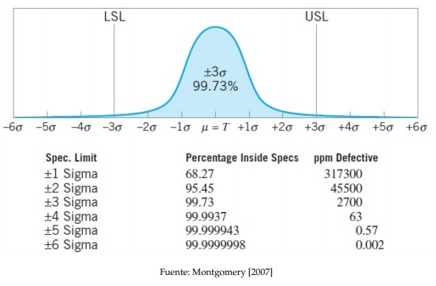

Figura: Variable normal centrada en µ = T, porcentaje de elementos no conformes segun el criterio Seis Sigma (capacidad de procesos). Se muestran los defectos,por millon (ppm Defective) esperados para cada nivel de calidad del producto o capacidad de proceso.

especificaciones es de 0.9973, que corresponde a 2700 partes por millón (ppm). Esto se conoce como _rendimiento de calidad Tres Sigma_. Sin embargo, supongamos que
consiste del ensamblaje de 100 componentes independientes las cuales deben ser no defectuosas para que el producto funcione satisfactoriamente. La probabilidad de que una unidad de producto específica sea no defectuosa es

$$0.9973 × 0.9973 × · · · × 0.9973 = (0.9973)^{100} = 0.7631$$

Esto es, alrededor del 23.7 % de productos elaborados bajo la calidad Tres Sigma serán defectuosos.Tomando en cuenta que muchos productos usados por la sociedad de hoy están compuestos de muchas partes, estos niveles de calidad son inaceptables. En la actualidad, Seis Sigma ha evolucionado desde su aplicación meramente como herramienta de calidad a incluirse dentro de los valores claves de algunas
empresas, como parte de su filosofía de actuación.

Seguidamente, en la _Figura 1_, se encuentra los paquetes existentes en R con aplicaciones directas al Control Estadistico de la Calidad (CEC), asi como las herramientas que proporcionan.


En esta práctica se relacionarán las herramientas de control estadístico de calidad con la metodología Seis Sigma. Seis Sigma es una metodología de mejora de procesos que persigue la reducción de la variación, los defectos y otros tipos de errores para alcanzar objetivos como aumentar la cuota de mercado, minimizar los costes, incrementar la ganancia, la eficiencia, la imagen de marca, etc. Aun teniendo un claro enfoque empresarial e industrial, sus procedimientos pueden aplicarse a campos como la investigación o la administración pública. 


En la Figura 2 se muestran las distintas etapas del proceso, su objetivo y la relación entre ellas.

 Hoy en día, Seis Sigma puede verse como un conjunto de métodos y procedimientos de aplicación de la estadística para la mejora y control de procesos productivos, de servicios o de I+D+I, desde un enfoque de CEC. Por esto último, en esta práctica se ha decidido presentar las diversas técnicas de CEC dentro de las etapas de la metodología Seis Sigma correspondientes. En la Figura 3 se enumeran las técnicas estadísticas de control de calidad susceptibles de aplicarse en cada una de las etapas del procedimiento Seis Sigma.
 
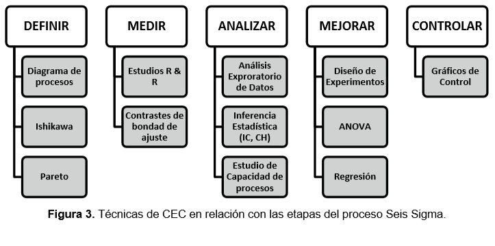

## Etapa __DEFINIR__

En esta estapa se identifica el problema, se establecen los objetivos y las prioridades para subsanarlo y, finalmente , se lanza el proyecto.

En la fase definir se identifican los posible proyectos Seis Sigma que deben ser evaluados por la dirreción para obtimizar los recursos. Habiendo identificado, seleccionado, estandarizado y documentado el proyecto, asi como sus puntos de medición y fuentes de varación, se prepara y selecciona el equipo más adecuado para ejecutarlo, asignándole la prioridad adecuada.

El objetivo de la fase _DEFINIR_ es reunir a todas las partes interesadas, captar sus conocimientos y puntos de vista acerca de los procesos involucrados, fijar un objetivo común y definir como contribuye cada parte ( o el papel que cada parte tiene) a la solución del problema (reducción de defectos, coste, consumo eléctrico,...) La contribución de cada parte, los hitos y responsabilidades deben escribirse en lo que se conoce como un __Mapa de Procesos__

### Mapa de Procesos

El mapa de procesos es una representación gráfica que identifica todos los procesos que existen en una empresa, laboratorio o proyecto en particular, además de mostrar la interrelación entre ellos.

Pasos para construir un mapa de procesos

a. _Identificación de las entradas y salidas:_
Las entradas y salidas del proceso constituyen el mapa de procesos de alto nivel. Las entradas del proceso aparecen identificadas mediante las _X_ mayúsculas dentro del mapa de procesos. Las __entradas__ _X_ suelen relacionarse con las __6 M__: Además de las seis __M__: `machines`, `methods`, `materials`, `measurements`, `mother nature` (medio ambiente), y `manpower` (mano de obra). Aparte de estas últimas, las entradas pueden identificarse con aspectos como la energía, las regulaciones, etc. Las __salidas__ se corresponden con __características de producto o servicio__. Las características __CTQ__ (variables críticas para la calidad, “Critical To Quality”) de la salida son las __Y__ del proceso.

b. _Identificación y listado de los pasos o etapas del proyecto_
Cuanto más detallada sea la división del proceso, más preciso será el análisis posterior. Hay dos tipos de etapas: las que implican un valor añadido al producto y las que no (como el transporte, el almacenamiento, la inspección, etc.). 


c. _Identificación de las caracteristicas o salidas de cada etapa_
Son las __y__ (en minúscula) del mapa de procesos. Pueden ser de un producto en proceso, materiales, datos… o mismo características del producto final, que pueden sufrir cambios de una etapa a otra.

d. _Identificar los parámetros correspondientes a cada etapa_
Los parámetros que afectan al proceso en una etapa determinada se conocen como las __x__ (en minúscula) de cada etapa. Estos parámetros condicionan en el coste, calidad u otros aspectos importantes de las salidas o características del producto.

e. _La clasificación de los Parámetros_
Es necesario evaluar la influencia de los parámetros en las características. Los parámetros pueden pertenecer a los siguientes grupos según su tipo de influencia:
  __N__ (de ruido): los factores no controlables. 
  __C__ (factores controlables): se pueden modificar durante el proceso. 
  __P__ (de procedimiento): factores controlables a través de un procedimiento estándar. 
  __Cr__ (críticos): los que tienen más influencia en el proceso.  

#### Caso Práctico: Ejemplo PIZZA

(Ver Práctica 1.- Ejemplo 1: Pizza) \@ref(pizza)

### Diagrama de Ishikawa o espina de pescado 

Los diagramas causa efecto, también llamados diagramas de ISHIKAWA o de espina de pescado, están indicados para asociar multiples causasa a un solo efecto.

#### Caso Práctico: Retrasos en la construcción de obras

(Ver Práctica 1.- Ejemplo 2: Ishikawa) \@ref(ishikawa)

### Diagrama de Pareto 

Una técnica clásica de visualización que se utiliza en la fase DEFINIR y disponible en los paquetes `qcc` y `qualityTools` es el diagrama de Pareto. Los diagramas de Pareto son un caso especial de los gráficos de barras que ayudan a separar las pocas causas que son vitales de las muchas que son triviales para un problema o un efecto dado. De esta manera los diagramas de Pareto nos permiten visualizar cuánto contribuye cada causa de un problema específico al efecto estudiado.

#### Caso Práctico: retrasos en la construcción de obras

(Ver Práctica 1.- Ejemplo 3: Pareto) \@ref(par)
 
 
## Epata __ANALIZAR__: ANOVA

### Introducción

  * Planteamiento del problema 
  
  El análisis de la varianza (ANOVA) es un método estadístico que permite estudiar la relación entre una variable dependiente __cuantitativa__ y una o varias variables independientes __cualitativas__. 
  
  * __Objetivo__
  
  Determinar si varias (k) muestras de una variable proceden de la misma población o de poblaciones distintas; es decir, contrastar simultáneamente la homogeneidad de las mismas.
  
  * __Conceptos básicos__
  
    + Factores: cada una de las variables independientes, causas de la posible heterogeneidad de las muestras.
    
    + Niveles del factor: cada uno de los valores posibles del factor. 
    
    + Efectos: medida de la influencia de los factores en la variable dependiente.
    
    + Error muestral: debido a la aleatoriedad en la selección de las muestras. 
    
  * __Clasificación de los modelos __
  
    + Según el número de factores; modelo con un único factor (modelo simple), modelo con varios factores (modelo múltiple)
    
    + Por la forma de disponer la información: modelo completamente aleatoriazado (se puede recoger la información de forma completamente aleatoria); modelo aleatorizado en bloques.
    
    + Por el tipo de efectos: modelo de efectos fijos (se fijan a priori los k niveles del factor y el contraste y las conclusiones del mismo se aplican a todos ellos). 
 
 
__PROYECTO: Análisis de la varianza de un factor, efectos fijos e información completamente aleatorizada__ 

  * Planteamiento Se trata de estudiar la relación
  entre: 
  
    + $Y$: variable dependiente (respuesta) cuantitativa 
  
    + $A$: variable independiente o factor cualitativa, cada uno de sus k  niveles define un grupo
  
  * Modelo probabilístico
  
  Hipótesis a establecer sobre el modelo: 
  
  + Existen $k$ niveles (grupos) del factor A: $i=1, 2, \dots, k$; a cada grupo $i$ le corresponde un valor de $Y$ dado por $Y_i$ 
  
  + Homoscedasticidad: 
  
  $$Var(Y_i)= \sigma^2 \ \ \ \forall i=1, 2, \dots, k $$
  
  + $\epsilon_i \mapsto N(0,\sigma^2) \ $: $Y_i \mapsto N(\mu_i,\sigma)$ 
  
  + En el modelo (b), 
  $\delta_i \mapsto N(0,\sigma_b)$
  
  Modelo: puede expresarse alternativamente como    

$$ \mu_i= \mu + \epsilon_i;\quad i=1,2,\dots,k $$
$$\mu_i= \mu + \delta_i + \epsilon_i; \quad  i=1,2,\dots,k;\quad \sum_{i=1}^k \delta_i = 0 $$


Las observaciones de $Y$ se podrian representar como

| Grupo   | Observaciones del factor |
| ------  | ------------------------ |
| 1       | $y_{11}$  $y_{11}$ $\dots$  $y_{1j}$ $\dots$ $y_{1n}$ |
| $\dots$ | $\dots$ |
|  i       |  $y_{i1}$ $y_{i2}$ $\dots$ $y_{ij1}$  $\dots$ $y_{in}$ |
| $\dots$ | $\dots$ |
|  k     |     $y_{k1}$ $y_{k2}$ $\dots$ $y_{kj}$  $\dots$ $y_{kn}$ |


## Etapa __MEDIR__

En la fase medir se identifican las características clave del producto (variables resultado) y los parámetros que afectan al funcionamiento del proceso (variables de entrada). Esta caracterización nos llevará a definir el sistema de medición (de materia prima e insumos, de las variables críticas del proceso, de los productos terminados, de las no conformidades, de la satisfacción del cliente, de la eficacia de los proveedores, de la eficiencia y/o eficacia de la organización) para así poder evaluar la calidad del proceso. 
 
  + Completar la identificación de características clave del proceso y completar el mapa de proceso.
  
  + Desarrollar el plan de recolección de datos. 
  
  + Validar el sistema de medición (evaluación R & R). 
  
  + Toma de datos. 
  
  + Comenzar a relacionar las características o salidas con las causas o entradas. 
  
  
 Es propio de esta etapa la caracterización de la distribución de probabilidad de cada variable o característica de estudio (por ejemplo, la evaluación de la normalidad de los datos).  
 
 
#### Caso Práctico: Etapa _ANALIZAR_: ANOVA 

(Ver Práctica 1.- Anova) \@ref(anova)


### Estudios R&R

Es un procedimiento muy común en estudio de procesos industriales que consiste en la evaluación de la repetitividad y la reproducibilidad de un sistema de medición. Llamamos __REPETITIVIDAD__ a la precisión de un sistema de medición (también llamado “Gage”), estimada mediante la desviación estándar de las mediciones realizadas sobre una misma pieza, por el mismo operario y la misma máquina. La __REPRODUCIBILIDAD__ es la parte de la varianza global debida al factor operador o máquina y a la interacción de operador o máquina con el factor pieza o unidad medida. El modelo general está dado por:

$$ \sigma_{total}^2= \sigma_{piezas}^2+\sigma_{\text{operador o  máquina}}^2+\sigma_{\text{operador o máquina x piezas}}^2 + \sigma_{error}^2 $$

Donde 

$$ \sigma_{Reproducibilidad}^2= \sigma_{\text{operador o  máquina}}^2+\sigma_{\text{operador o máquina x piezas}}^2 $$

$$ \sigma_{Repititividad}^2= \sigma_{error}^2 $$
$$ \sigma_{RR}^2= \sigma_{Reproducibilidad}^2+ \sigma_{Repititividad}^2$$

El procedimiento para evaluar si un sistema de medida es adecuado es el siguiente:

  1) Aplicar un análisis de la varianza con dos factores y su interacción (máquina u operador, pieza -unidad en general- y su interacción). Si el factor operador y su interacción con piezas son significativos, el sistema de medida no es el adecuado. Han de completarse los resultados con los parámetros calculados en el punto 3. 
  
  2) Calcular las varianzas relativas a la repetitividad y reproducibilidad. 
  
  3) Calcular parámetros derivados de estas dos varianzas que son indicadores de la bondad del sistema de medida y complementan los resultados del ANOVA. Estos indicadores se expresan como % o tanto por uno de la varianza total, de 6· desv. típ., etc. 
 
 
 En un estudio R & R, los resultados finales se dan en porcentaje de la variación de la repetitividad. 
 
 Antes de recolectar datos de su proceso (por ejemplo, para controlar o analizar la capacidad del proceso), se deben utilizar estudios R & R para confirmar que el sistema de medición mide de forma uniforme y exacta, y que discrimina adecuadamente entre partes.
 
 
#### Caso práctico Gage R & R: tecnología mecánica-sistema de medida del diámetro de una junta tórica de caucho 

(Ver Práctica 1.- R&R) \@ref(RyR)


___

## Etapa __CONTROL__: 


En la fase de control deben monitorizarse o someter a vigilancia los logros conseguidos en etapas anteriores, así como documentar las nuevas condiciones o especificaciones del proceso de estudio. Esta etapa está caracterizada por el empleo de herramientas basadas en la detección de errores y su corrección: las más representativas son los gráficos de control.

El objetivo último de la mejora de la calidad no es sólo ofrecer productos de buena calidad, sino también mejorar la productividad y la satisfacción de los clientes (que permitirá afrontar el gasto del proceso de mejora). Una forma de mejorar la productividad es a través de la reducción de los defectos y las revisiones, por inspección y control de los procesos en curso antes de que se generen productos o servicios defectuosos.

Las variaciones de las características medidas son desviaciones de los objetivos prefijados. Aparecen independientemente de que el proceso esté o no bajo control. Las causas que originan la variaciones se dividen en dos categorías: __comunes__ (E. Deming) o __aleatorias__ (W. Shewhart), cuando son inherentes al proceso de producción, y __especiales__ (E. Deming) o __asignables__ (W. Shewhart ) cuando no son atribuibles al proceso de producción (por ejemplo, un operador que tiene sueño). Importante: para ser capaz de predecir el nivel de calidad de los productos o servicios, los procesos que los generan han de ser __estables__, es decir, con total ausencia de causas especiales de variación. 


### Gráficos de control

El gráfico de control es la herramienta más usada en el análisis de variaciones con el fin de evaluar, monitorear y controlar el redimiento de los procesos de producción o servicios; mediante el uso de los gráficos de control se pretende identificar variaciones en el proceso debido a causas comunes y causas especiales. A través de los años, los gráficos de control se han posicionado entre los medios de control operativo más importantes, hasta adquirir tanta importancia como los controles de costos y materiales. La tecnología moderna de los ordenadores ha facilitado la implementación de los gráficos de control para cualquier tipo de proceso, ya que es posible obtener y analizar los datos en tiempo real y en línea en el centro de trabajo. [Scepi and Acconcia, 1996]

Un gráfico de control es un gráfico de dos dimensiones cuyo eje y representa la variable que estamos monitorizando. Los valores de la característica a medir se representan secuencialmente con respecto al tiempo. Los valores de la variable pueden ser individuales o, más comúnmente, los promedios referidos a grupos de tamaño 4, 5, etc., llamados muestras racionales. El eje x de la gráfica muestra los números de identificación para el conjunto de ítems (individuales o grupos). Los valores de la variable se representan con puntos unidos mediante líneas rectas, para poder identificar patrones indicadores de cambios significativos en el rendimiento del proceso. Gráficamente, se caracterizan por:

  •	Una línea central (CL). Media de las variables incluidas en la muestra. Los valores monitorizados varían en torno a esta media.
  
  •	Límite de control inferior (LCL), por debajo del cual es muy poco probable que se produzcan realizaciones de la variable.
  
  •	Límite de control superior (UCL). El LCL y UCL son simétricos si la distribución de probabilidad de la variable es simétrica (se suele utilizar la normal).

Utilidades de los gráficos de control:

  •	Evitar que el proceso esté fuera de control, detectando las causas asignables a cada variación de la característica medida y tomando las medidas al respecto.
  
  •	Para no hacer ajustes cuando no se necesitan. La mayoría de los procesos de producción dan a los operadores margen de maniobra para hacer ajustes en los equipos que están utilizando. Los gráficos de control pueden indicar cuando los ajustes son necesarios y cuando no lo son.
  
  •	Para determinar el rango natural (límites de control) de un proceso y para comparar este rango con sus límites especificados. Si el rango de los límites de control es más amplio que el de los límites especificados, el proceso va a generar productos defectuosos y tendrá que ser ajustado.
  
  •	Dar a conocer la capacidad y estabilidad del proceso, entendiendo como capacidad de proceso a su adecuación para ofrecer productos dentro de los límites especificados continuamente en el tiempo.
  
  •	Para llevar a cabo el proceso de monitorizado del proceso y así evitar los defectos en el producto final.
  
  •	Para facilitar la planificación de la asignación de recursos de producción. Las variaciones de una característica de calidad determinan la cantidad de defectos. Tener información para predecir estas variaciones ayuda a asignar los recursos.

Entre las varias razones para el uso de los gráficos de control, Montgomery [2007]
destaca las siguientes:

  * Son una técnica comprobada para reducir la variabilidad
  * Son efectivos en la prevención de defectos
  * Previenen ajustes innecesarios en el proceso
  * Proveen información de diagnóstico__
  * Proveen información acerca de la capacidad del proceso
  

__Los gráficos de control se construyen en dos fases__

El uso del gráfico de control estándar implica aplicaciones de fase I y fase II, con
dos objetivos diferentes y distintos.

En la fase I, un conjunto de datos históricos procesados es recolectado y analizado a la vez en un análisis retrospectivo, usando esta muestra preliminar se estiman los límites de control. En esta fase se identifican las principales causas de variación asignables y se toman las medidas para corregirlas, hasta lograr la estimación de los límites de control de la variable CTQ correspondiente al proceso bajo control. Los límites de control se calculan como un intervalo de confianza. Se suelen tomar aquellos que distan de la media en tres desviaciones típicas $(\mu \pm 3\sigma)$. Al conjunto de datos históricos se lo denomina muestra de calibrado, siendo el contraste de hipótesis $(H_0)$ sobre una misma población F. Así, en la fase I comparamos una colección de m puntos contra un conjunto de límites de control calculados a partir de esos puntos. Se recomienda que los límites de control naturales se estimen a partir de una muestra de calibrado constituida por
20 o más observaciones. [Montgomery, 2007] 

Es bastante usual suponer que en la fase I el proceso está inicialmente fuera de control, por lo que el objetivo del analista es llevar el proceso a un estado de control estadístico. Los límites de control se calculan en función de los m subgrupos y los datos graficados en los gráficos de control. Se investigan los puntos que están fuera de los límites de control, en busca de posibles causas asignables. Los puntos fuera de los límites de control se excluyen y se calcula un nuevo conjunto de límites de control revisados. Luego se recopilan nuevos datos y se comparan con estos límites revisados. En ocasiones, este tipo de análisis requerirá varios ciclos en los que se emplee el gráfico de control, se detecten y corrijan las causas asignables, se calculen los límites de control revisados y se actualize y amplíe el plan de acción fuera de control.
 
Los tipos de causas asignables que usualmente ocurren en la fase I resultan en cambios de proceso bastante grandes. La longitud de corrida promedio (ARL) no es un buen indicador de rendimiento para esta fase, dado que se busca la probabilidad de que se detecte una causa asignable en lugar de la aparición de falsas alarmas.


En la fase II, las muestras tomadas posteriormente se representan en un gráfico con los límites de control anteriores. Cuando las observaciones individuales de la variable de estudio __X__ están dentro de los límites de control, se dice que el proceso está estadísticamente bajo control. Los límites de control son completamente diferentes de los límites de especificación (aquellos aceptados por el cliente o fijados por los ingenieros, que representan la consigna o target). 

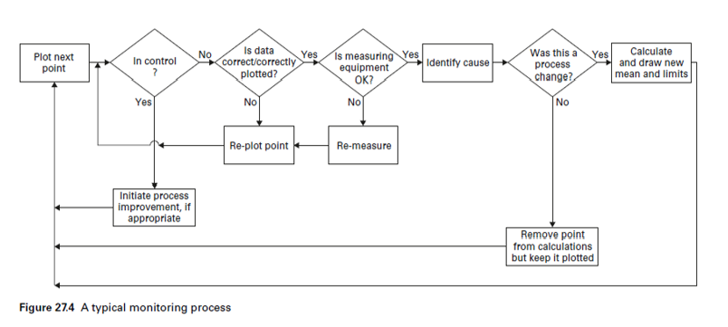

La __Figura 1__ muestra el proceso estándar de monitorización de una variable CTQ (critical to quality).

_Nota_: Las hipótesis de partida para los gráficos de control que a continuación se muestran  son la normalidad e independencia de las observaciones. Existen gráficos de control para medidas dependientes y variables no normales (por ejemplo Weibull). Sin embargo, los gráficos EWMA son insensibles a la no normalidad de los datos (Montgomery, 2005), caso completamente contrario a los gráficos de medidas individuales.

__Ventajas de los gráficos de control de atributos:__ 

Los gráficos de control de atributos tienen la ventaja de resumir rápidamente los diversos aspectos de la calidad de un producto, es decir, el ingeniero puede simplemente clasificar los productos como aceptables o inaceptables, basándose en diversos criterios de calidad. Por tanto, la elaboración de gráficos de atributos no requiere procedimientos especialmente costosos en tiempo ni necesitan el empleo de precisos dispositivos de medición. Además, este tipo de gráfico tiende a ser más fácil de entender por los gerentes que no están familiarizados con los procedimientos de control de calidad.

__Ventajas de los gráficos de control de variables:__

Gráficos de control de variables son más sensibles que los gráficos de control de atributos. De hecho, los gráficos de control de variables nos pueden alertar de problemas de calidad antes de que se produzca cualquier “fuera de control” o “inaceptable” real que pudiera ser detectado por el diagrama de atributos. 

__Reglas para la detección de procesos fuera de control (Western Electric Handbook, 1956):__

  1. Un punto fuera de los límites de control $3\sigma$.
  2.	Dos puntos de tres consecutivos más allá de los límites de aviso $2\sigma$.
  3.	Cuatro de cinco puntos consecutivos a una distancia de  $\sigma$ o más de la línea central.
  4.	Ocho puntos consecutivos a un lado de la línea central.

No se suelen utilizar más de 3 reglas a la vez para evitar incurrir en falsos rechazos de la $H_0$ (proceso bajo control). La librería R `qcc` emplea la regla 1 y otra regla que detecta como estado fuera de control la situación donde más de 6 medidas seguidas están a un lado de la CL.

### Gráficos de control multivariantes

Cuando varias variables aleatorias caracterizan la calidad de un proceso/servi- cio, es necesario aplicar técnicas estadísticas de control de calidad multivariante. Existen dos retos formidables en el análisis de procesos de datos multivariantes. Primero, los datos se vuelven más dispersos mientras aumenta la dimensión. Re- querimientos de tamaños de muestras son formidables y una muestra de referencia de cientos de miles de observaciones puede ser necesitada para caracterizar por completo un proceso en control si tres o más variables de calidad (que no siguen una distribución normal multivariante) son medidas. Usar gráficos de control indi- viduales para monitorear las p características independientes separadamente puede ser muy engañoso. Si una de las variables está fuera de control, el sistema resultaría fuera de control. Si P(Error Tipo I) = $\alpha$, entonces el error Tipo I para el control con- junto de las p medidas independientes, puede ser muy grande para un valor grande de p, $\alpha´$ = 1 − (1 − $\alpha)^{p}$. De igual forma, si todas las variables están fuera de control, todo el sistema estaría fuera de control. Si P(Error Tipo II) = $\beta$, entonces el error Tipo II para el control conjunto de las p medidas independientes, puede ser muy grande para un valor grande de p, $\beta ´$ = 1 − (1 − $\beta)^p$.
Por lo tanto, los límites de control son diferentes a los construidos; si las varia- bles son dependientes, el cálculo del nivel de significancia, α, se vuelve complicado. Este tema es particularmente importante hoy en día, ya que los procedimientos de inspección automáticos hacen que sea relativamente fácil medir muchos parámetros
 
en cada unidad de producto fabricado.[Montgomery, 2007]
Más aún, existen cambios en la localización o escala mientras no sea posible con- trolar la estructura de correlación entre dos (o más) variables. En este sentido, es posible tener dos variables las cuales estén ambas en control cuando son consideras por separado en un sentido univariante, pero fuera de control cuando son conside- radas en conjunto bajo un esquema multivariante [Wierda, 1994].

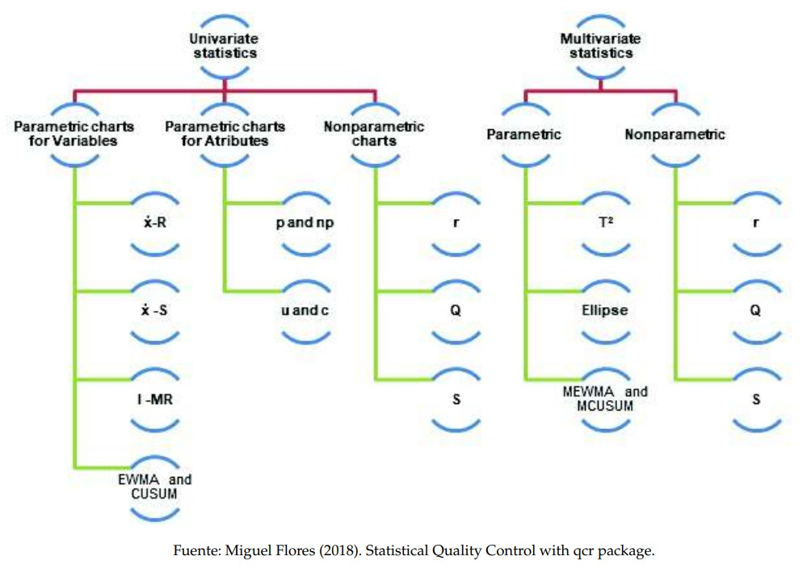 


Figura 1.12: Clasificación de gráficos de control de acuerdo al tipo de muestra y distribución de las observaciones

En la figura 1.12 se muestran los distintos tipos de gráficos de control estándar dependiendo si el proceso está definido para uno o más variables y de si se asume o no una distribución paramétrica para las observaciones.


### Graficos de control por variables 

Para el control de una característica medible y representada por una variable aleatoria __X__, existen dos tipos de gráficos, por una parte aquellos que nos ayudan a controlar las medidas de posición (de la media o mediana) y, por otra, los que controlan la dispersión de la variable (gráficos de desviaciones, varianzas o recorridos). Este tipo de gráficos son más informativos que los gráficos de atributos; aparte de darnos una idea de la conformidad o no conformidad del proceso, nos dan información acerca del nivel o magnitud.

En este curso se trabajará fundamentalmente con dos paquetes: el paquete qcc y la librería qcr (desarrollada por Miguel Flores). 

__Librería qcc__

El paquete R `qcc` sirve principalmente para generar gráficos de control. Primero se crea un objeto `qcc.groups`, utilizando la función con el mismo nombre, con los siguientes argumentos: las medidas en formato de vector y la identificación de las mismas como pertenecientes a un grupo. A continuación, se crea un objeto `qcc` con el objeto `qcc.groups` como argumento, indicando el tipo de gráfico de control. Una vez creado el objeto `qcc`, podemos realizar dos acciones sobre él: un resumen y un gráfico. 

Para trabajar con casi todas las funciones y aplicaciones que existen dentro de este paquete estadístico, debemos crear un objeto `qcc`.

Necesitamos básicamente dos cosas: unos datos (un data frame, una matriz, un vector,..) y un "string value" especificando el tipo de control que deseamos hacer (por atributos o por variables).

También, opcionalmente, se pueden modificar el tamaño (sizes), el tipo de estimación de la desviación estándar (std.dev), los límites de control (limits), el valor objetivo del proceso (target)…

La única diferencia que existe a la hora de trabajar con variables o con atributos radica en "type". Para variables podemos optar por elegir entre "xbar", "xbar.one", "R" o "S" y para atributos tenemos "p", "np", "c", "u" o "g".

__EJEMPLO 2.1__ : Gráficos qcc para variables \@ref(gqcc)

__Librería qcr__

Es una librería creada fundamentalmente para obtener gráficos de control univariantes ("xbar.one", "R" o "S"  y "p", "np", "c", "u" o "g") y multivariantes (MEWMA, MCUSUM y T2). Presenta algunas mejoras en el proceso de obtención de los límites de control naturales de una variable CTQ.


En esta sección se utilizará como ejemplo el siguiente caso práctico:

Una conocida empresa química está desarrollando la patente de una nueva variante de piedra artificial, compuesta en su mayor parte por cuarzo (93 wt%) y resina de poliéster. Esta compañía pone en marcha una planta piloto donde se comienzan a producir planchas de este material a escala industrial. Con el fin de medir el grado de homogeneidad del producto, se toman 50 submuestras, realizándose 5 medidas por plancha de la dureza Vickers correspondiente a distintas zonas de la piedra artificial (Ejercicio1.r). ¿Qué tipo de gráficos de control serían los más adecuados para controlar el nivel y la dispersión? Hallar los límites de control natural 3σ con una muestra de calibrado y, seguidamente, monitorizar las muestras restantes. Comentar los resultados, identificar patrones e identificar sus posibles causas.

(ver __Practica 2__)

__Ejemplo 2.2__: tiempos de renderizado \@ref(renderizado)


#### Gráficos de control $\hat{x}$ y R, $\hat{x}$  y S

__$\hat{x}$ y R__

Cuando una característica de calidad es una variable, es necesario controlar tanto el valor medio de la característica como su variabilidad. El gráfico $\bar{x}$ se usa para controlar la media del proceso, mientras que la variabilidad se puede monitorear con un gráfico de control para el rango denominado gráfico de control R.

Para construir límites de control, debemos calcular la media y el rango de cada muestra $\bar{x}_i$ y $R_i$, respectivamente $i = 1, \dots, n$. La media global y el rango se calcularán
como:
$$ \bar{R}=\frac{\sum_i R_i}{ k} \quad \text{y} \quad \bar{\bar{x}}=\frac{\sum_i \bar{x}_i}{k}$$
Puesto que $\frac{R_i}{d_2}$ es un estimador insesgado, donde $d_2$ es un estadístico de rango que representa la media del rango relativo dado por $W = \frac{R}{\sigma}$, luego, $ \frac{\bar{R}}{d_2}=\frac{\sum_i R_i}{ d_2 k}$ se usará como estimador centrado de la desviación estándar teórica. A partir de eso hay que contrastar si cada valor $\bar{x}_i$ está en el intervalo
$$ \left[ \bar{\bar{x}}-\frac{3\bar{R}}{\sqrt{n} d_2}; \bar{\bar{x}}+\frac{3\bar{R}}{\sqrt{n} d_2} \right] $$
 con una probabilidad aproximada al $ 97,73\%$ 

Entonces los límites de control son:
$$ LCI = \bar{\bar{x}}-\frac{3\bar{R}}{\sqrt{n} d_2}$$
$$ LCS = \bar{\bar{x}}+\frac{3\bar{R}}{\sqrt{n} d_2}$$

__$\hat{X}$ y R__

A veces es deseable estimar la desviación estándar del proceso directamente en lugar de indirectamente mediante el uso del rango R, esto lleva a gráficos de control para $\bar{x}$ y S, donde s es la desviación estándar de la muestra.
Para la construcción de los límites de control, la media y la desviación deben calcularse para cada muestra $\bar{x}_i$ y $s_i$, respectivamente $i = 1, . . . , n$. La media global es un estimador insesgado de la media teórica, mientras que la desviación estándar muestral es un estimador sesgado de la desviación estándar teórica, luego 

$$ \hat{\sigma} = \frac{\bar{s}}{c_2}= \frac{\sum_i s_i}{c_2 k }$$
se usara como un estimador centrado de la desviación estándar téorica, donde $c_2$ es una constante que depende del tamaño de muestra n.
Cada valor $\bar{x}_i$ debe estar en el intervalo 
$$ \left[ \bar{\bar{x}}-\frac{3\bar{s}}{\sqrt{n} c_2}; \bar{\bar{x}}+\frac{3\bar{s}}{\sqrt{n} c_2} \right] $$
 con una probabilidad aproximada al $ 97,73\%$
Entonces los límites de control para la media son:
$$ LCI = \bar{\bar{x}}-\frac{3\bar{s}}{\sqrt{n} d_2}$$

$$ LCS = \bar{\bar{x}}+\frac{3\bar{s}}{\sqrt{n} d_2}$$
La desviación estándar se debe estimar mediante el análisis de datos pasados.

Primero se procede a cargar la librería `qcc`, suponiendo que ya haya sido instalada a través del CRAN de R. 

Veamos el código en R para el caso de la base de datos `Ejercicio1:`


#### Gráficos de control para medidas individuales

También se pueden construir gráficos de control por variables para las observaciones individuales tomadas en una línea de producción. Este tipo de gráficos se hacen imprescindibles cuando el coste de cada observación es muy alto y, por tanto un sistema de muestreo como el anteriormente descrito es inasumible. Ejemplos: el número de quejas de los clientes o devoluciones de productos que sólo está disponible una vez al mes, los casos en los se lleva a cabo una inspección automática de cada unidad de producto, etc. En ese último caso, el interés radica en detectar pequeños cambios en la calidad del producto (por ejemplo, el deterioro gradual de la calidad debido al desgaste de la máquina). Aparte de los gráficos para muestras individuales y rangos medios, los gráficos CUSUM y EWMA pueden ser alternativas más adecuadas en estas situaciones.

En el siguiente ejemplo se simula el caso particular de una empresa de animación por ordenador (Bran Entertaiment) que dispone de 3 operarios para realizar operaciones de renderizado de imágenes. Hasta hace relativamente poco sólo una persona se dedicaba a este trabajo, siendo especialista. Debido a su periodo de vacaciones, otro operario de la empresa, el de más antigüedad, se ocupó del proceso hasta el momento en que pidió una baja. A partir de ese momento, un becario fue el encargado del proceso. Se pretende obtener los límites de control natural del proceso e identificar las causas asignables de aquellos valores fuera de control.

__NOTA__: el proceso de renderizado se desarrolla con el fin de generar en un espacio espacio 3D formado por estructuras poligonales una simulación realista del comportamiento tanto de luces, texturas y materiales (agua, madera, metal, plástico, tela, etcétera) como también de los comportamientos físicos. Este es el caso de la simulación de colisiones y fluidos,  ambientes y estructuras físicas verosímiles.`

#### Interpretación de los gráficos $R-\bar{x}$

Seguidamente se muestran una serie de patrones que suelen aparecer en el estudio de este tipo de gráficos de control, a modo de guía para una interpretación de los mismos:

__Gráfico 1.1:__ Un patrón natural es aquel en el que no existe ninguna relación identificable entre los puntos trazados. No hay puntos que caigan fuera de los límites de control, la mayoría de los puntos están cerca de la línea central, y algunos puntos están cerca de los límites de control. Los patrones naturales son indicativos de un proceso que está en control.

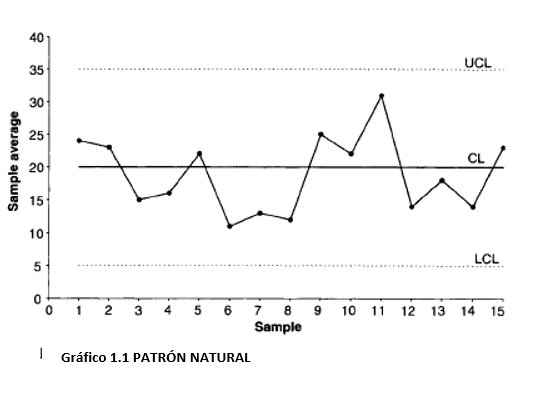


__Gráfico 1.2:__ Muchas causas pueden provocar un cambio repentino en el nivel en un gráfico de la media. Los cambios bruscos se producen debido a los cambios en las configuraciones de proceso como temperatura, presión o la profundidad del corte. Un ejemplo de cambio repentino podría ser un cambio en el tiempo de espera del cliente en un supermercado porque el número de cajeros disponibles ha cambiado. Nuevos operadores, nuevos equipos, nuevos instrumentos de medición, nuevos proveedores y nuevos métodos de procesamiento son otras razones para los cambios repentinos en los gráficos media y rango.

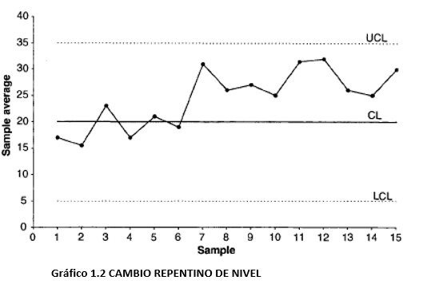


__Gráfico 2.1:__ Se producen Cambios graduales en el nivel cuando un parámetro de proceso cambia gradualmente durante un período de tiempo. Después, el proceso se estabiliza. Un gráfico de la media puede exhibir ese cambio, porque la calidad de entrada de materias primas o componentes cambió con el tiempo, porque se modificó el programa de mantenimiento o el estilo de supervisión. En cuanto al gráfico R, ese cambio puede surgir a causa de un nuevo operador, una disminución de la habilidad de los trabajadores debido a la fatiga o la monotonía, o una mejora gradual de la calidad de entrada de las materias primas (debido por ejemplo a que un proveedor ha desarrollado un sistema de control estadístico de procesos).

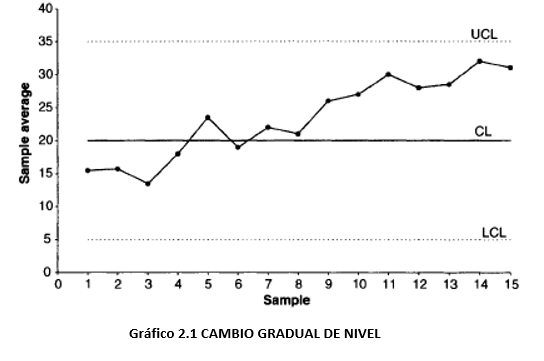


__Gráfico 2.2:__ Las tendencias se diferencian de los cambios graduales en que las tendencias no se estabilizan o atenúan. Las tendencias representan cambios,  incrementos o decrementos, de pendiente constante. Un diagrama x ̅ puede exhibir una tendencia debido al desgaste progresivo de una herramienta que afecta al proceso productivo, deterioro gradual de equipos, acumulaciones de suciedad en moldes y accesorios, a un cambio gradual en la temperatura o mismo el aumento del consumo eléctrico debido a la contratación creciente de personal. Un gráfico R puede mostrar una tendencia debido a una mejora gradual de la habilidad del operador como resultado de la formación en el puesto de trabajo o a una disminución de la habilidad del operario debido a la fatiga.

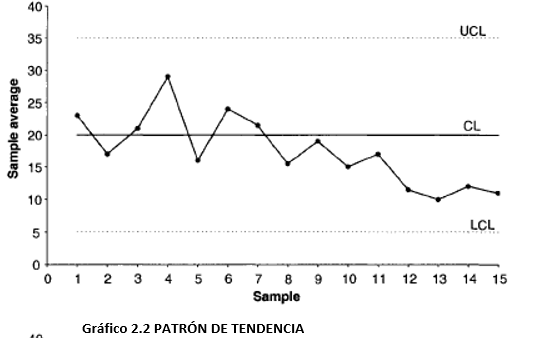


__Gráfico 3.1:__ Los patrones cíclicos se caracterizan por un comportamiento periódico repetitivo en el sistema. Un gráfico  x ̅  puede mostrar un comportamiento cíclico debido a la rotación de los operadores, cambios periódicos en la temperatura y la humedad (por ejemplo, un inicio en frío por la mañana), la periodicidad de las propiedades mecánicas y químicas de un material determinado, o la variación estacional de las materias primas recibidas (p. ej., alimentos). Un gráfico R puede presentar patrones cíclicos debido a la fatiga del operador y su posterior activación después de las pausas, la diferencia entre los turnos, o el mantenimiento periódico de los equipos, etc. Si se toman muestras con muy poca frecuencia, se corre el riesgo de sólo representar los puntos de mayor o menor nivel del ciclo. Por eso se deberían tomar muestras de referencia si se sospecha algún comportamiento cíclico en el proceso.

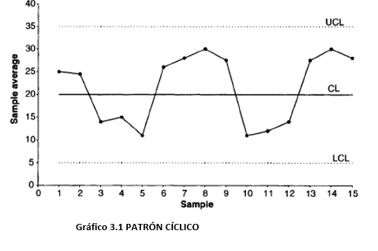


__Gráfico 3.2:__ Wild patterns o patrones salvajes se refieren a puntos que son estadísticamente diferentes al resto. Se clasifican en Freaks y Bunches (o grupos). Los freaks se deben a perturbaciones externas que influyen en una o más muestras. Son puntos demasiado pequeños o demasiado grandes con respecto a los límites de control. Algunas de las causas especiales de los freaks incluyen, fallos repentinos de energía en una instalación, el uso de una nueva herramienta de prueba para un breve período de tiempo, el fallo de un componente, etc.

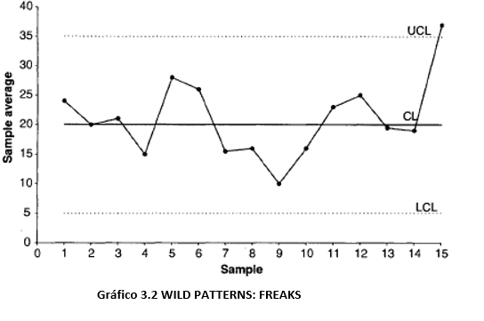


__Gráfico 4.1:__ Los bunches o grupos, son agrupaciones de varias observaciones que son decididamente diferentes de los demás puntos de la trama. La aparición de un nuevo proveedor por un corto período de tiempo, el uso de una máquina diferente de forma puntual y el trabajo de un operario contratado por unas horas o un día pueden causar la aparición de estos patrones.

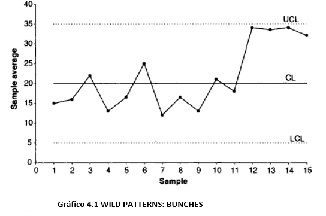


__Gráfico 4.2:__ Los patrones de mezcla se deben a la presencia de dos o más poblaciones en los datos estudiados y se caracterizan porque los puntos del gráfico caen cerca de los límites de control, estando ausentes del área cerca de la línea central. La existencia de un conjunto de valores demasiado altos y demasiado bajos puede ser debida a las diferencias en la calidad de las materias primas proporcionadas por dos proveedores diferentes. La opción correctora indicada es la elaboración de un gráfico diferente para cada proveedor. Estos patrones pueden aparecer al no separar los resultados obtenidos por dos o más máquinas, operadores, sistemas de medición, métodos de producción, fábricas, establecimientos, etc.

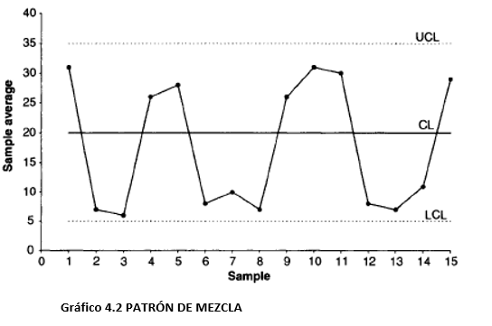


__Gráfico 5.1:__ Los patrones de estratificación aparecen cuando dos o más distribuciones poblacionales de la misma característica de calidad están presentes en el mismo gráfico. En este caso, las dos poblaciones aparecen mezcladas en cada submuestra. Este patrón se caracteriza por el hecho de que la mayoría de los puntos están muy cerca de la línea central, con casi ningún punto cerca de los límites de control. Podría llevarnos erróneamente a la conclusión de que el proceso está bajo control. Por ejemplo, tenemos datos obtenidos en turnos, cada uno diferente con diferente rendimiento. Para impedir la aparición de estos patrones, se deberían tener gráficos de control independientes para cada turno. Se puede evitar este fenómeno eligiendo cuidadosamente las submuestras, con el objeto de no mezclar poblaciones.

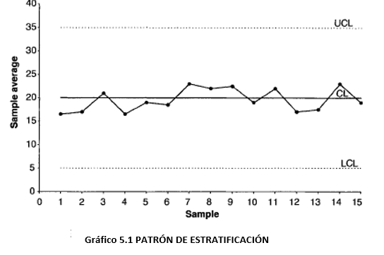


__Gráfico 5.2:__ Se produce un patrón de interacción cuando el nivel de una variable afecta al comportamiento de otras variables asociadas con la característica de calidad de interés. Por otra parte, el efecto combinado de dos o más variables sobre la característica de calidad de salida puede ser diferente del efecto individual de cada variable. Ejemplo: supongamos que en un proceso químico,  la temperatura y la presión son dos variables controlables importantes que afectan a la característica de calidad (salida) de interés. Una baja presión y una temperatura elevadas pueden producir un efecto muy deseable en la característica de salida, mientras que una presión baja por sí misma no tiene en absoluto ese efecto. Un método de muestreo efectivo implicaría el control de la temperatura a varios valores altos de la misma, para luego determinar el efecto de la presión sobre la característica de salida y para cada valor de temperatura. 

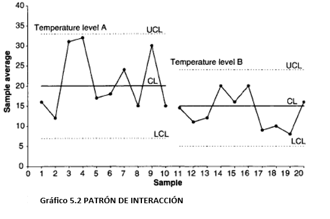 


### Gráficos de control para atributos

En ocasiones una característica de calidad no puede o no interesa medirse numéricamente y tan solo se observa si presenta o no determinada propiedad (un producto es defectuoso o no, una pieza encaja o no en otra, un mecanismo funciona o no funciona, etc.). En control de calidad suele emplearse el término conformidad o no conformidad en lugar de éxito o fracaso (defecto). 

#### Gráficos de Control p

Proporción de disconformidades. Si __p__ es la proporción poblacional de unidades no conformes:

$$ UCL = \bar{p} + 3\frac{\sqrt{\bar{p}(1-\bar{p})}}{\sqrt{n}} \quad \text{y} \quad UCL = \bar{p} - 3\frac{\sqrt{\bar{p}(1-\bar{p})}}{\sqrt{n}} $$
En este tipo de gráfico, se muestra el porcentaje de unidades defectuosas (por lotes, por día, por cada máquina, etc.) como en el gráfico U. Sin embargo, los límites de control de este gráfico no se construyen utilizando la distribución de eventos poco frecuentes, sino  la distribución binomial (de proporciones), que por el Teorema central del límite se aproxima a una normal $(np>5$ y $n(1-p)>5$, siempre que __p__ no sea excesivamente próximo a 0 o 1). Por lo tanto, este gráfico es adecuado en situaciones donde la ocurrencia de unidades defectuosas no es poco común (por ejemplo, donde el porcentaje de unidades defectuosas pueda ser más del $5 \%$ del número total de unidades producidas).

__Nota__: El número de no conformidades se distribuye como una $B(n,p)$, que, si se cumplen las condiciones, se puede aproximar a una $N(n·p, \sqrt{(n·p·(1-p))}$. Entonces, la proporción media $\bar{p}$ se distribuirá como una $N(\mu,\frac{\sigma}{\sqrt{n}})$.


#### Gráficos de control np 

Número de disconformidades. Si p es la proporción poblacional de unidades no conformes:

$$UCL=n\bar{p}+3·\sqrt{n\bar{p}(1-\bar{p})} \quad \text{y}   \quad LCL=n\bar{p}-3·\sqrt{n\bar{p}(1-\bar{p} )} $$

Es la versión en número de no conformes del gráfico p (multiplicando los sus límites por n). Se representa el número de unidades defectuosas (por lotes, por día, por cada máquina) como en el gráfico C. Sin embargo, los límites de control en esta tabla no se basan en la distribución de eventos raros, sino en la distribución binomial, al igual que en el gráfico p. Por lo tanto, este gráfico debe utilizarse si la ocurrencia de unidades defectuosas no es poco común (más del $5 \%$ de las unidades revisadas). Por ejemplo, se podrá usar este gráfico para controlar el número de unidades producidas con defectos de menor importancia.


#### Gráficos de Control c

Número de disconformidades por unidad. Siendo c la media y la varianza de una distribución de Poisson (del número de defectos), que se puede aproximar a una normal cuando $c > 5$:

$$UCL=\bar{c}+3·\sqrt{(\bar{c} )} \quad \text{y} \quad    LCL=\bar{c}-3·\sqrt{(\bar{c} )} $$

En este gráfico, se muestra el número de unidades defectuosas (por lotes, por día, por equipo, por cada 100 metros de tubería, etc.). Los límites de control en este gráfico se calculan a partir de la distribución de Poisson (distribución de los eventos poco frecuentes).


#### Gráficos de control u

Número medio de disconformidades por unidad de control. Si u=x/n , siendo x el número de no conformidades en una muestra y n el número de unidades inspeccionadas:

$$UCL=\bar{c}+3·\sqrt{\frac{\bar{c}}{n}} \quad \text{y} \quad    LCL=\bar{c}-3·\sqrt{\frac{\bar{c}}{n}} $$

En este gráfico, se representa la tasa de unidades defectuosas, es decir, el número de unidades defectuosas dividido por el número de unidades de inspección (la n puede ser, por ejemplo, metros de tubería, número de lotes, etc.). A diferencia del gráfico C, no se requiere un número constante de unidades, por lo tanto, el gráfico U se puede utilizar cuando las muestras-lotes son de diferentes tamaños.

#### Ejemplo Gráfico p

Datos Zumo de naranja `(orangejuice)`: 

__Ejemplo 2.4__: Gráficos tipo P \@ref(P)

#### Ejemplo Gráfico np

Datos Zumo de naranja `(orangejuice)`: 

__Ejemplo 2.5__: Gráficos tipo NP \@ref(np)

#### Ejemplo Gráfico C

Datos Placas impresas `(Circuit boards data)`:

__Ejemplo 2.6__: Gráficos tipo C \@ref(gc)

#### Ejemplo Gráfico U

Datos del fabricante de ordenadores personales `(Personal computer manufacturer data)`: 

__Ejemplo 2.7__: Gráficos tipo U \@ref(gu)


### Otros graficos de Control univariante

Si estamos interesados en detector pequeñas tendencias o desplazamientos a lo largo de las sucesivas submuestras, podemos construir dos tipos de gráficos más sensibles que los  tradicionales. Estos son los gráficos CUSUM y los gráficos EWMA. Sin embargo, ambos gráficos funcionan peor que el gráfico de medias cuando se trata de detectar grandes cambios. El gráfico CUSUM se introdujo por primera vez por Page (1954); los principios matemáticos involucrados en su construcción se discuten en Ewan (1963), Johnson (1961), y Johnson y Leone (1962). En el caso de los gráficos EWMA, se puede consultar Montgomery (2001).

Tienen mejor rendimiento cuando se aplican a muestras individuales.

#### Gráfico CUSUM

Si se representa la suma acumulada de las desviaciones de las medias de las sucesivas submuestras con respecto a la media del proceso, desplazamientos permanentes, incluso los cambios menores, con respecto a dicha media darán lugar a una considerable suma acumulada de desviaciones. Por lo tanto, este gráfico es muy adecuado para la detección de esos pequeños cambios permanentes que pueden pasar desapercibidos utilizando el gráfico de $\bar{X}$. Ejemplo: debido al desgaste de la máquina, un proceso poco a poco "se desliza" hacia el fuera de control, produciendo resultados por encima de las especificaciones. El uso de este gráfico podría dejar patente el incremento o decremento continuado de la suma de las desviaciones respecto a las especificaciones.

Se contabilizan las desviaciones acumuladas negativas y positivas:

$$ C_i^{-} = \max{( 0,(C_{i-1}^- - (x_i - \mu))-K)}, \quad C_i^{+} = \max{( 0,(C_{i-1}^+ + (x_i - \mu))-K)}$$

Donde. $C_0^{-}=C_0^{+}=0$, $K$ es el valor a partir del cual la desviación acumulada es significativa. Si la suma acumulada hasta la observación i-ésima es menor que cierto umbral $K=k·\sigma$, se considera que la desviación acumulada es cero. El valor de __K__ se suele elegir según la desviación que se quiera detectar. Los valores $\pm H$ son los límites de control de este gráfico ($H = h·\sigma = 5·\sigma$).

El estadistico $s_r$ se usará para determinar si el proceso esta bajo control o no 
$$ s_r = \sum_{i=1}^r(\bar{x}_i - \mu_0) \sim N \left(r(\mu-\mu_0), \frac{r\sigma_0^2}{n}\right) $$


__Ejemplo práctico con los datos pistonrings y el paquete qcc:__

bajo los supuestos de normalidad, donde $\mu_0$ es el objetivo para el promedio del proceso

__Ejemplo 2.8__: Gráficos CUSUM \@ref(cusum)

#### Gráficos EWMA de medias móviles ponderadas de forma exponencial 

Los gráficos EWMA son un gráfico de medias móviles ponderadas, donde las muestras más cercanas tienen un mayor peso en el cálculo de la media para un punto dado. Para este tipo de gráficos se toman normalmente datos individuales. Las observaciones individuales pueden ser medias (cuando las observaciones individuales de las que provienen las medias no están disponibles), lecturas individuales, cocientes, proporciones o medidas similares.

La idea de construir un gráfico de medias móviles se puede generalizar del siguiente modo. En vez de calcular una media aritmética móvil, se puede calcular una media móvil geométrica, dando lugar al gráfico del mismo nombre (Montgomery, 1985, 1991).

$$ z_t = \lambda x_t+(1-\lambda)z_{t-1}$$
donde $0<\lambda \leq 1$ y el valor inicial $(z_0=\mu_0)$ es el objetivo del proceso 

Este método especifica que la ponderación correspondiente a la media de una muestra vieja irá decreciendo geométricamente según continuamos a dibujar muestras. El gráfico EWMA nos permite detectar pequeños sesgos o desplazamientos en, por ejemplo, la media de la característica medida y, por tanto, en la calidad del proceso de producción.

La línea central y los limites de control para la tabla de control EWMA son los siguientes 
$$LCI = \mu_0 - 3\sigma \sqrt{\frac{\lambda(1-(1-\lambda)^{2i})}{2-\lambda}}$$
$$LC = \mu_0$$
$$LCS = \mu_0 + 3\sigma \sqrt{\frac{\lambda(1-(1-\lambda)^{2i})}{2-\lambda}}$$
Si el valor de $i$ es alto, los limites de control son:
$$LCI = \mu_0 - 3\sigma \sqrt{\frac{\lambda}{2-\lambda}}$$
$$LC = \mu_0 $$
$$LCS = \mu_0 + 3\sigma \sqrt{\frac{\lambda}{2-\lambda}}$$

Ejemplo práctico con los datos pistonrings y el paquete qcc:

__Ejemplo 2.9__: Gráficos EWMA \@ref(ewma)


### Curvas OC

Una curva característica de operación (CO) proporciona información acerca de la probabilidad de no detectar un cambio en el proceso cuando este ocurre de verdad. Esto se conoce generalmente como el error de tipo II, es decir, la probabilidad de aceptar erróneamente un proceso como en control. 
 
Realizaremos a continuación las __curvas OC__ para desviaciones de la media. La probabilidad de error de tipo II de no detectar un desplazamiento (medido en $nº$ de desviaciones típicas del proceso) con respecto a la media bajo control, tiene la forma:


Las __curvas CO__ se pueden obtener fácilmente a partir de un objeto de la clase `qcc`. La opción más sencilla es crear un objeto `qcc` (por variables o por atributos).

En el caso de gráficos por variables, utilizamos como ejemplo los datos `pistonrings`: 

__Ejemplo 2.9__: CURVAS OC \@ref(oc)


____


## Etapa __ANALIZAR__: Analisis de capacidad
### Introducción
#### Analisis de capacidad

  * __Objetivo__ Estimar lo bien que un proceso se ajusta a las tolerancias definitivas por la empresa, los clientes, la normativa, etc.
  
  * __Definiciones__
    + Cunstificación de la variabilidad del proceso y el análisis de esta variabilidad en comparación con las especificaciones del producto final.
    
    + Comparación de la distribución de pñrobabilidad de una característiica de calidad con respecto a unas efecificaciones o tolerancias fijadas para la misma.
    
    + Porcentaje del proceso fuera de especificaciones.

  * __Aplicaciones__
  
    + Predecir lo bien que un proceso se ajusta a las especificaciones
    
    + Ayudar a la modificación de un proceso
    
    + Especificación de requisitos para la adquisición de nuevos equipos 
    
    + Selección entre varios proveedores.
    
    + Reducción de la variabilidad en un proceso.
    
  * __Requisitos__
    
    + El proceso ha de estar bajo control
    
    + Se supone que se conoce la distribución de probabilidad de la característica de calidad del proceso. La suposición más común es que los datos se distribuyen segúb una distribución normal.
    
    + Si bien existen alternativas robustas no paramétricas
    
    + También para datos autocorrelacionados
    
  * __Herramientas__
  
    + Histogramas 
    
      - Estimación de la distribución de probabilidad de la característica CTQ 
      - Comparación con los limites de tolerancia 
    
    + Graficos Cuantil Cuantil
    
      - Bondad de ajuste, Fiables con <100 observaciones
      
    + __indices de Capacidad__
    
      - Primera generación: Cp
      
      - Degunda generación: Cpu, Cpl, Cpk
      
      - Tercera generación: Cpm, Cpkm
      
      - Indices no paramétricos/ robustos.
      
      - Indices para una caracteristica CTQ autocorrelada
      
  
  
### Indices de capacidad

#### Generalidades 

  * Definición:
    
    + Indicadores desarrollados para medir si un proceso es capaz o no en relación a las tolerancias/especificaciones fijadas por los clientes/empresa.

    + Grado en el que la variabilidad de un proceso, debida a causas comunes, ocupa el intervalo de tolerancia definido por los clientes.

  * Características:
  
    + Índices altos indican que un proceso es capaz de producir artículos o servicios que cumplen las especificaciones de los clientes.

    + Dan información acerca del:

      - Número de no conformidades esperadas.

      - Desplazamiento de la distribución de la característica de calidad con respecto al objetivo o "target“

    + Cuánto más grande sea el índice calculado, habrá menos productos no 
conformes.

    + Dependen de los límites de tolerancia o consigna (LSL, límite inferior de tolerancia y ULS, límite superior de tolerancia) y los correspondientes a la distribución de probabilidad paramétrica de los datos (límites naturales de control).

#### Indices paramétricos

  * __Primera Generación__
  
    + Medida de la capacidad potencial del proceso 
    
    $$ C_p = \frac{USL-LSL}{6 \sigma} = \frac{USL-LSL}{X_{0.99865}-X_{0.00135}}$$
    $$ \hat{C}_p = \frac{USL-LSL}{6 \hat{\sigma}}  $$
  * __Segunda Generación__
  
    + $C_{pk}$ describe el desempeño de la capacidad del proceso, capacidad real
    
    + Tiene en cuenta distacia del valor medio de la característica CTQ a los limites de  especificación. A partit de $C_{pu}$ y $C_{pl}$
    
| $C_{pu}= \frac{USL-\mu}{3\sigma}$  | $\hat{C}_{pu}=\frac{USL-\hat{\mu}}{3\hat{\sigma}}$  |
| :---------------------------------: | :-------------------------------------------------: |
| $C_{pl}= \frac{\mu-LSL}{3\sigma}$  | $\hat{C}_{pl}= \frac{\hat{\mu-LSL}}{3\hat{\sigma}}$ |
| $C_{pk}= \min{C_{pu},C_{pl}}$      | $\hat{C}_{pk}= \min \{\hat{C}_{pu},\hat{C}_{pl} \}$ |          

   $C_p$ y $C_{pk}$: Se utilizan para comparar la capaacidad potencial del proceso (hasta donde puede llegar en lo que a varabilidad se refiere) y la capacidad real.
   
  * __Tercera Generación__ 

    + $C_{pm}$ es un índice de calidad que en su expresión SÍ tiene en cuenta la distancia de la media del proceso al valor objetivo/nominal/Target (T).
    
    + $C_{pkm}=\frac{C_{pk}}{\sqrt{1+(\frac{\mu-T}{\sigma})^2}}$ nace como una corrección del $C_{pk}$ para dotarlo de sensibilidad a desplazamientos de la media de la distribución $\mu$ con respecto al “target” T . 
    + $C_p(u,v)$ generaliza todos los índices en función del los parámetros u y v. 
    
    
| $C_{pm}= \frac{USL-LSL}{6\sqrt{\sigma^2 + (\mu -T)^2}}$  |  $\hat{C}_{pm}= \frac{USL-LSL}{3\sqrt{\hat{\sigma}^2 + (\hat{\mu} -T)^2}}$ |
| :------------------: | :----------------:                |
| $C_{pkm}= \frac{d - |\mu -m|}{3\sqrt{\sigma^2 + (\mu -T)^2}}$  |  $\hat{C}_{pkm}= \frac{d - |\mu -m|}{3\sqrt{\hat{\sigma}^2 + (\hat{\mu} -T)^2}}$           |
| $C_p(u,v)=\frac{d - u|\mu -m|}{3\sqrt{\sigma^2 + (\mu -T)^2}}$ |  |
| $C_p(0,0)=C_{p}$    | $C_p(1,0)=C_{pk}$ |
| $C_p(0,1)=C_{pm}$   | $C_p(1,1)=C_{pkm}$ |
| Siendo $d=\frac{USL-LSL}{2}$ | $m=\frac{USL+LSL}{2}$|
    
    
    
    
### Analisis de capacidad en R

#### Libreria qcc

__Ejemplo 1__: Simulacion Grosor Yates \@ref(yate) 

#### Libreria SixSigma

__Ejemplo 2__: Botellas de Refresco \@ref(sigma)

#### Libreria qualityTools

__Ejemplo 3a__: Simulacion distribución normal \@ref(qtools)

__Ejemplo 3b__: Simulacion distribución Weibull \@ref(qtools)

__Ejemplo 4__: Pistorings (datos Agrupados) \@ref(qtools)

### Análisis de capacidad con datos no normales 

#### Transformacón de datos 

  * Es importante trabajar sobre la distribución correcta de los datos, sino se puede llegar a obtener un número de no conformidades erroneo
  
  * Aplicar una Transformación de __Box Cox__ a los datos es una forma de estimar correctamente la capacidad de un proceso cuando este no es normal
  
$$y_i^{(\lambda)}= \left\{ \begin{array}{lcc}
             \frac{y_i^{(\lambda)}-1}{\lambda} &   si  & \lambda \not = 0 \\
             \\ ln(y_i) &  si & \lambda  = 0 \\
             \end{array}
   \right.$$
   
   * Los datos transformados sí serán normales, pudiendose aplicar de forma fiable los índices de capacidad anteriormente deefinidos
   
   * La librería qualutyTools de R permite aplicar transformaciones de __Box-Cox__, que sea la óptima (respecto a $\lambda$) que proporciona por defecto o fijando un $\lambda$ determinado


#### Indices no paramétricos 

  * Si no se verifica la suposición de  normalidad de los datos u otra distribución paramétrica conocida, no se deben utilizar los índices anteriormente descritos, pues nos llevarían a conciderar una proporción de no conformidades errónea. 
  
  * Índices que no asumen ninguna distribución conocida para la característica CTQ. 
  
  * Chang y Lu (1994) propusieron el índice $C_p(u,v)$para distribución arbitraria:
  
  $$C_{Np}(u,v)=\frac{d-u|M-m|}{3\sqrt{\frac{F_{99.865}-F_{0.135}}{6}+v(M-T)^2}}$$

  $$\hat{C}_{Np}(u,v)=\frac{d-u|\hat{M}-m|}{3\sqrt{\frac{\hat{F}_{99.865}-\hat{F}_{0.135}}{6}+v(\hat{M}-T)^2}}$$

Los Cuantiles  $F_{0.99865}$ y $F_{0.00135}$ se estiman mediante los percentiles de la distribución empírica sacada de la muestra $\hat{F}_{0.99865}$ y $\hat{F}_{0.00135}$. M es oa mediana de la distribución, $d=\frac{USL-LSL}{2}$ y $m=\frac{USL+LSL}{2}$ 

__Ejemplo 5__: Peso de Altavoces \@ref(Altavoces)


__Ejemplo 6__: Piedra artificial \@ref(Piedra)


___

## Etapa __CONTROLAR__ y __ANALIZAR__ 
### CEC multivariante: Reducción de la Dimención

Cuando varias variables aleatorias caracterizan la calidad de un proceso/servicio, es necesario aplicar técnicas de control estadístico de calidad multivariante.

Si analizamos cada una de las variables por separado, la probabilidad de que una observación de la variable aparezca dentro de los límites calculados cuando SE SABE que realmente el proceso esta bajo control, ya NO SERÁ 0.9973 para una un intervalo 6·Sigma, SERÁ $(0.9973)^{(Nº de variables)}$ = 0.9946. (suponiendo las 2 variab. del ej. sig.). Mientras que $\alpha_{nuevo} = 1-(1-\alpha)^{nºde variables}$

Conclusión, los límites de control son diferentes a los dibujados.

Pero esto se cumple en el caso que las variables sean independientes, donde la probabilidad de la intersección es el producto de probabilidades.

Si las variables son dependientes, el cálculo del nivel de significación, alfa, se vuelve muy complicado: Hay que estudiar las variables conjuntamente, de forma multivariante 

__Ejemplo 7__: Control del contenido de contaminantes en el queroseno. \@ref(queroseno)

Otra alternativa es estudiar las variables por separado, aplicando la corrección de Bonferroni: $\alpha_{Bonferroni} = \alpha/(\text{nº de combinaciones posibles, dos a dos, de variables})$, o mismo dividiendo alfa entre 2*nº de variables [Ver Alt (1985)].
Inconveniente: demasiado conservador con la hipótesis nula (proceso bajo control).

__Ejemplo 8__: Aproximación univariante utilizando una corrección tipo BONFERRONI. \@ref(BONFERRONI)

__Ejemplo 9__:Control de calidad multivariante con gráficos Shewhart.  \@ref(Shewhart)

__Ejemplo 10__:Control de calidad multivariante con gráficos MEWMA y MCUSUM. \@ref(MEWMA)

__Ejemplo 11__:Cotrol de humedad relativa, temperatura y consumo eléctrico.\@ref(adjustment)

#### PCA
__Análisis de componentes principales
(PCA):__


  * __Objetivo:__
  
    + Reducir el número de variables que caracterizan un conjunto de individuos.
    + Poder aplicar métodos multivariantes de forma fiable (clasificación, regresión,
control de calidad).

 * __Características:__
    + A partir de una matriz de datos con "p"
variables, se obtiene otra matriz de datos
con "p" componentes principales (nuevas
variables).
    + La primera componente principal de se
obtiene al proyectar los vectores de
observaciones en la dirección de la máxima
varianza de los datos.
    + La segunda componente se obtendrá al
proyectar la información restante en la
dirección de su máxima varianza y así
sucesivamente hasta obtener la nuevas p
componentes.
    + Las "p" componentes son ORTOGONALES e
INDEPENDIENTES entre sí.

  * __Ventajas:__
    + Útiles cuando tenemos una gran cantidad
de variables. Con cerca de 10 variables los
gráficos clásicos no son fiables.
    + El ARL1 se incrementa al incrementar el nº
de variables, se tarda más en detectar un
verdadero fuera de control.
    + Muchas veces se puede resumir la mayor
parte de la información de la base de datos
en apenas dos variables.
    + Las proyecciones pueden cumplir las
hipótesis de normalidad y no
autocorrelación, lo que hace aplicables los
gráficos de Shewhart.

  * __Inconvenientes: __
    + Es difícil descubrir cuál es la variable
original que origina el fuera de control y,
así, identificar las causas asignables.
  
  * __Cálculo: __
    + Descomposición en valores singulares de la
matriz de características X (SVD):
$$ X =UDV^T=PT^T$$

U y V son matries ortogonales de vectores singulares, D = matriz diagonal de autovalores, P = loadings (peso de las antiguas variables en las nuevas), T = scores (coordenadas de las observaciones en las nuevas variables).
 
__Análisis de componentes principales
(PCA):__

  * __Problema a resolver:__

    + Se obtienen datos del consumo energético
(medido en kW), 3 variables de
temperatura ambiente, 3 variables de
concentración de CO2 y 3 variables que
miden la humedad relativa (HR) en tres
zonas diferentes de una oficina.
    + Miden la calidad de la eficiencia energética,
del confort térmico y la calidad del aire de
la oficina.
    + DATOS referidos a las 18:00 de la tarde
durante 45 días laborables
 

__Ejemplo 11__: Reducción de dimensión: Análisis de componentes principales  \@ref(pca)
 
#### Mínimos cuadrados parciales (PLS):

  * __Objetivo:__
  
    + Reducir el número de variables que
caracterizan un conjunto de individuos.
    + Poder aplicar métodos multivariantes de
forma fiable.

  * __Características:__
    + Se expresan los vectores de características
según nuevas componentes o variables,
pero en la obtención de las mismas se ha
tenido en cuenta la existencia de una
matriz de variables independientes X y una
variable respuesta Y.
    + Los datos se proyectan en una nueva base
que tiene en cuenta la relación lineal entre
Y y X.
    + Ideal cuando se tienen muchas variables X,
o parámetros, de los que depende la
característica a controlar Y.
  * __Caso práctico:__
    + Controlar la eficiencia energética de las
instalaciones de climatización de una oficina
a partir del consumo eléctrico.
    + En el consumo eléctrico influyen
parámetros de confort térmico y calidad del
aire (se consume para mantener unos
estándares de calidad de estos últimos).
 
__Ejemplo 12__: Reducción de dimensión: Mínimos cuadrados parciales (PLS) \@ref(pls)

### CEC para variables autocorrelacionadas

Se ajustarán modelos de series de tiempo "Autoregressive integrated moving average" previo paso a la aplicación de gráficos de control.

Se suele expresar como ARIMA(p,d,q) donde los parámetros p, d y q son números enteros no negativos que indican el orden de las distintas componentes del modelo, respectivamente, las componentes autorregresiva, integrada y de media móvil. También se puede incluir una parte para la componente estacional

p es la componente autorregresiva: a "grosso modo" de cuántas observaciones pasadas (cada una con su parám, phi_i) depende la actual.
q es la componente de medias móviles:de cuántos términos de error correspondientes a observaciones anteriores (cada una con su parám, $\theta_i$) depende la actual.
d indica d las diferencias que son necesarias para convertir la serie original en estacionaria.

__Ejemplo 13__: Control del confort climático en oficinas \@ref(oficinas)

#### Series de tiempo y gráficos de los residuos

  * __Objetivo:__
    + Si no se cumple la hipótesis de
observaciones independientes, los gráficos
de control tipo Shewhart no son fiables.
    + Se pretende "extraer" la autocorrelación y
poder aplicar de forma fiable los gráficos
estándar.
    + El procedimiento más usual para resolver
este problema es el ajuste de un modelo de
series de tiempo, obtención de los residuos
y posterior aplicación de los gráficos de
control.
  * __Procedimiento:__
    + Se verifica que no se cumple la hipótesis de
independencia de las observaciones.
    + En caso afirmativo, se ajusta un modelo de
series de tiempo autorregresivo de medias
móviles (ARIMA), por ser el más flexible.
    + Una vez modelizada la autocorrelación, se
obtienen y controlan los residuos
(independientes) mediante gráficos tipo
Shewhart , EWMA, T2, MEWMA...

  * __Series de tiempo:__
    + Colección de mediciones de un cierto
fenómeno registrada de forma secuencial
en el tiempo $Y(t_1),Y(t_2)$...

    + Componentes: tendencia, componente
estacional, cíclica y aleatoria.
    + Modelos dinámicos para estimar y predecir
los valores de una serie de tiempo:
modelos de Box-Jenkins.

  * __Modelos Box-Jenkins:__
    + Modelos autorregresivos:
    
    $$ X_t = c + \sum_{i=1}^p \phi_i X_{t-i}+\epsilon_t $$
    + Modelos autorregresivos:
    
        $$ X_t = \epsilon_t + \sum_{i=1}^q \theta _i \epsilon_{t-i} $$
    + Modelos autorregresivos integrados de
medias móviles:

$$ Y_i=-(\Delta^d Y_t-Y_t)+\phi _0 + \sum_{i=1}^p \phi_i \Delta^d Y_{t-i}-\sum_{i=1}^q \theta_i \epsilon_{t-i}+\epsilon_t$$
__Ejemplo 14__: Ejemplo practico ARIMA \@ref(ar1)

EWMA para datos autocorrelados

  * __Objetivo:__
    
    + Se pretende obtener unas bandas de
confianza móviles que tengan en cuenta la
autocorrelación de los datos.
  
  * __Procedimiento:__
   
    + Montgomery y Mastrangelo (1991)
sugirieron una aproximación basada en
EWMA:

$$x_t=x_{t-1}+ \epsilon_t - \theta \epsilon _{t-1}$$
  
   + Se puede demostrar que las medias ponderadas exponencialmente son un buen predictor de X en procesos AR(1) y con un $\lambda = 1 -\theta$

$$\hat{x}_{t+1}(t)=Z_t$$

    
   + Siendo $Z_i$
    
$$Z_t=\lambda x_t + (1-\lambda)Z_{t-1}$$
    
    
  + Y $e_t$ los residuos
    
$$e_t=x_t-\hat{x} _t(t-1)$$
    
  
  + A partir de la estimacion de la variabilidad de los errores se pueden calcular unas
banda de confianza móviles para procesos
autocorrelados

### Análisis de capacidad para datos autocorrelados

  * __Objetivo:__
  
    + Supóngase que la característica de calidad
del proceso sigue un proceso estacionario
autorregresivo de orden 1, AR(1) con
parámetro $\Phi_1$ tal que |$\Phi_1 < 1$. Entonces el
proceso se puede escribir como:

$$ X_t-\mu = \phi_1(X_{t-1}-\mu)-a_t$$
    + Donde $a_t \sim  N(0,\sigma_{\alpha}^2)$ y $\mu$ la media del proceso.
    
  * __Índices propuestos por Wallgren
(1996, 2001):__

$$C_{pmr} = \frac{USL - LSL}{ \sqrt[6]{\sigma_r^2+(\mu-T)^2}} $$
    
$$C_{pkr}=min \left(  \frac{USL - \mu}{3\sigma_r^2},\frac{ \mu-LSL}{3\sigma_r^2}\right)$$
   
   + Donde $\sigma_r^2=\alpha _r^2/(1-\Phi_1)$

__Ejemplo 15__: Datos autocorrelacionados \@ref(autocorr)

___


## Introducción al diseño de experimentos con R


### Ejemplos de contrastes ANOVA

__Ejemplo 5.1:__ Ejemplo de la tracción del horigón armado (con acero) Sujeto a tres tratamientos diferentes \@ref(aceros)

__Ejemplo 5.2:__ Ejemplo de los laboratorios que miden el peso de muestras de estaño. Respuesta: peso \@ref(estaño)

__Ejemplo 5.3:__ Exprerimento para medir la velocidad de la luz ideado por Morley \@ref(luz)

__Ejemplo 5.4:__ Diseño que incluye el test de Tuckey para la resistencia a la rotura de la lana (con dos tipos diferentes) en un telar \@ref(lana)

### Diseño de experimentos factorial $2^k$ 
Para obtener más información sobre el modelo de caja negra por el cuál la combinación de los distintos niveles de factores trtamiento y nuisance originan cambios en la variable respuesta, se puede crear un diseño factorial de $2^k$ utilizando la funcion **facDesign** del paquete ´qualityTools´. Como se indica en los libros de texto y en los apuntes de la materia, $k$ denota el número de factores y 2 es el número de niveles por factor. Un diseño con $k$ factores y 2 combinaciones por factor se caracteriza por estar formado por $2^k$ combinaciones de factores diferentes, denominados réplicas o "runs"

__Ejemplo 5.4:__ Fiabilidad de una resina epoxy (polímero) con fibras de carbono \@ref(resina)

### Diseño de experimentos factoriales fraccionarios

Supóngase que se prueban 5 factores diferentes en un diseño de $2^k$, dando lugar a $2^5=32$ réplicas. Es probable que esto sea bastante costoso de ejecutar en cualquier máquina de ensayo, proceso o configuración experimental en un proceso de producción o investigación. Antes de descartar el diseño, es aconsejable reflejar lo que este diseño es capaz de hacer. Es decir, qué tipos de interacciones puede estimar. La interacción más alta en un diseño $2^5$ es la interacción entre los cinco factores ABCDE. Esta interacción, aunque sea significativa, es realmente difícil de interpretar, y es probable que no exista. Lo mismo se aplica a las interacciones entre cuatro factores y algunas de las interacciones entre 3 factores, por lo que, en lugar de sus correspondientes diseños completos, la mayoría de las veces se consideran diseños factoriales fraccionados ya desde las primeras etapas de la experimentación.

Para diseños factoriales fraccionados, se puede utilizar el método **fracDesign** del paquete. Para un diseño de $2^3$ (es decir, 3 factores que deben analizarse en un $2^2$ réplicas al confundir el tercer factor con la interacción entre los dos primeros factores) esto estaría dado por el argumento gen="C=AB", que significa que la interacción entre A y B debe confundirse con el efecto de un tercer factor C. El efecto estimado para C se confunde con la interacción AB; es decir, no pueden estimarse por separado, por lo tanto, C = AB (alias) o el alias de C es AB.

**Caso de estudio**

Se ajusta el modelo paramétrico de Paris, dependiente de los parámetros C y m (su valor depende del tipo de material) para estimar la longitud de grietas en un material en función del número de ciclos de esfuerzos a fatiga.

Se trata de ver si el efecto de unos parámetros de un modelo de fiabilidad (prueba de fatiga tipo Paris) son significativos sobre la respuesta, error de ajuste del modelo, a la par que se analiza el posible efecto de la interacción. Lo que se quiere dilucidar es si el modelo de Paris ajusta mejor o peor dependiendo del material (C y m) y su heterogeneidad $(\sigma_C, \sigma_m, \sigma_{Cm})$.

__Ejemplo 5.5:__ EJEMPLO de DISEÑO FRACCIONADO 1/4 \@ref(f1)

### Estudios Interlaboratorios 

 Un estudio interlaboratorio se puede definir como un procedimiento de control para evaluar el rendimiento de un grupo de laboratorios a traves de un ensayo en colaboración [1,2]. En un estudiio interlaboratorio, un número adecuado de los laboratorios son elegidos para participar en el experimento con el objetivo de anaizar las muestras y obtener resultados.

los laboratorios participantes reciben muestras (previamente homogeneizadas o ser homogeneizadas por los laboratorios) para el análisis, acontinuacion, ñas mediciones de resultados de los laboratorios se evalúan de acuerdo con el grado de variabilidad de los datos. Alguno de  los factores más comunes que pueden ser una causa de la variabilidad son 
 
  * el equipamiento de laboratorios 
  * los operadores 
  * los materiales 
  * la temperatura 
  * la humedad
  
Varias técnicas estadisticas escalares se aplican con frecuencia para estudiar la consistencia de los resultados de prueba de los diferentes laboratorios que participan en un ILS. Norma ASTM E-691 (Práctica estándar para la realización de un estudio entre laboratorios para determinar la precisión de una prueba modelo) recomienda aplicar sólo una gráfica de Mendel k y h estadisticas, mientras que ISO 5735-2 (Presición-veracidad y precisión de los métodos de medición y resultados) recomienda además de la  técnica gráfica, para utilizar el test de Cochran y Grubbs


Además, a través de análisis de varianza (ANOVA), el efecto del factor de laboratorio sobre la respuesta puede ser estudiado. La varianza de la repetibilidad y reproducibilidad puede ser también estima cuando se considera un modelo de efectos aleatorios ANOVA, como se muestra en la norma ISO 5725-2. Por otra parte, si un modelo de efectos fijo es ajustado, además de la prueba F, comparaciones múltiples de medios se pueden realizar con el método Tukey Honest Significant Difference (HSD).

Para llevar a cabo pruebas de coherencia para las hipótesis de repetibilidad y reproducibilidad, así como para la detección de valores atípicos, los valores de los estadísticos deben ser comparados con sus correspondientes valores críticos. Si éstos son mayores, la incoherencia se detecta en los resultados de los laboratorios. ISO 5725-2 proporciona algunos valores críticos en función del número de laboratorios p, número de mediciones n y el nivel de significacia $\alpha$. 

En la actualidad, tanto ISO 5725 y ASTM-E691 no proporcionan una metodología para la
realización de un ILS cuando los datos son funcionales, esto es, en el caso en que los resultados de la prueba son curvas (datos funcionales). Análisis de datos funcional (FDA) es relativamente una nueva rama de la estadística que toma las curvas como unidad de análisis, también las superficies y volúmenes definidos de forma continua (como el tiempo, o el dominio de frecuencia). Teniendo en cuenta los  últimos avances en la ciencia de la computación y la creciente cantidad de datos generados por las técnicas experimentales y sensores, la FDA ha tenido un gran desarrollo en los últimos años. De hecho, tenemos muchas metodologías estadísticas que se han desarrollado y extendido al caso funcional, tales como análisis exploratorio, regresión, clasificación, análisis de varianza, y las series de tiempo. En el caso específico ILS, las extensiones del Analisis de Datos Funcionales (FDA) para Mandels h y k se han propuesto y descrito por Miguel Flores.
El proposito del paquete ILS  es, por un lado, para facilitar el uso de nuevas herramientas en el contexto del (FDA) y, por otro lado, para proporcionar un conjunto completo de tests de valores atípicos univariados más utilizados para el ILS con  respuesta escalar. Es importante tener en cuenta que las técnicas del FDA para los estudios entre laboratorios que se basan en las propuestas de Naya, Flores, y  sobre todo, la propuestas de Flores. Con lo que las nuevas extensiones funcionales de h y k Se introducen las estadísticas para identificar los laboratorios no consistentes.

Las funciones que se han implementado en el paquete ILS pueden determinar los estadísticos de  Mandel h y k, tanto en forma gráfica y analítica, utilizando un enfoque funcional. Estas pruebas estadísticas también se han implementado para facilitar la ejecución de los estudios de repetibilidad y reproducibilidad (R&R) cuando los datos son funcionales. además, el paquete  ILS se aplicar a los métodos sugeridos por las normas ASTM E-691 e ISO 5725-2 para el caso escalar. El paquete ILS está disponible en la red global de R Archivo en http://CRAN.Rproject.org/package=ILS . 

La presente librería ILS implementa y pide algunas de sus rutinas con el fin de realizar la detección de valores atípicos en el marco de los estudios entre laboratorios. Por lo tanto, con respecto a ILS con la respuesta escalar, hay algunas herramientas computacionales interesantes y útiles en R software. A saber, la `metRology` del paquete estima la incertidumbre de la medición, y lleva a cabo los cálculos estadísticos necesarios para estudios entre laboratorios, mientras `multcomp` realiza un análisis de la varianza (ANOVA) a través de pruebas F y Tuckey. Por otro lado, debido a la exponencial creciente del FDA, también hay un número en continuo aumento de las librerias de R dedicadas a la investigación de esta rama de la estadística. Entre todos ellos, los paquetes más importantes y utilizados (en que se basa la presente propuesta) son `fda.usc`, Que implementa las técnicas de detección de valores atípicos y ANOVA funcional, entre otras herramientas para FDA. El presente paquete ILS utiliza las aplicaciones de la antes mencionada `multcomp` y `fda.usc`.

__Ejemplo 5.5:__ ESTUDIOS INTERLABORATORIO (CASO PARTICULAR DE DOE Y ESTUDIOS R&R) 
\@ref(ilab)

