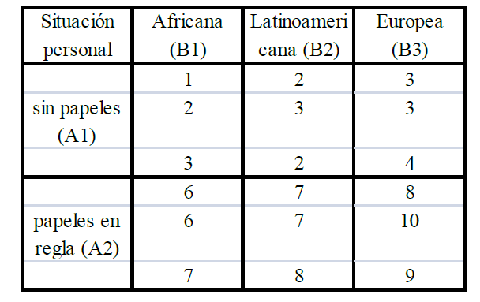

# Práctica 1

## CEC y Seis Signa: alternativas en R

## Etapa _DEFINIR_: Mapas de  procesos, Ishikawa, Pareto

### Mapas de procesos{#pizza}


```{r warning=FALSE,message=FALSE}
library(SixSigma)
library(qcc)
library(qualityTools)
library(knitr)
```


__Ejemplo de la PIZZA__ 

El gerente de un restaurante quiere estudiar el proceso de preparar y servir una pizza, por lo que se plantea hacer un mapa de procesos.

 Después de recoger algunos datos de su personal, determina que las entradas son los ingredientes (ingredients), el cocinero (cook), el horno (oven), y los platos (plates); las salidas o características del proceso son la temperatura (temperature), el sabor (taste), la ternura (tenderness), el peso (weight), el radio (radius) y el tiempo total para servir la pizza (time). Estas salidas son las características principales (CTQ) de la pizza.
 
 El proceso de hacer y servir una pizza se divide en las siguientes etapas: 
 
  * Preparar la masa. 
  * Añadir los ingredientes. 
  * Hornear la pizza. 
  * Entregar la pizza al cliente.
 
 Suponemos que las __“entradas de cada etapa” son las salidas del paso anterior__. Las entradas para la fase primera __f__ son las __X__ definidas previamente (ingredientes, cocina, horno y platos). A continuación, se describen en detalle los parámetros y los resultados correspondientes a cada paso (con la clasificación de los parámetros entre paréntesis).
 
__Primera etapa__. Masa:

  * Parámetros: cocinero (C), la marca de la harina (C), la proporción de agua (P). 
  * Salidas: masa (densidad, dureza y grosor). 
  
__Segunda etapa__. Adición de ingredientes:

  * Parámetros: cocinero (C), la marca de los ingredientes (Cr), la cantidad de ingredientes (P), tiempo de preparación (Cr). 
  * Salidas: pizza cruda (diámetro, peso, espesor).
  
__Tercer paso__. Cocción u horneado:

  * Parámetros: cocinero (C), colas (N), el tiempo de cocción (Cr). 
  * Salidas: pizza al horno (temperatura, ternura, sabor). 
 
__Cuarto paso__. Entrega: 

  * Parámetros: camarero (C), colas (N). 
  * Salidas: pizza en la mesa (temperatura, sabor, ternura, peso, radio, tiempo). 


 Una vez definidas las etapas con sus x e y, creamos los siguientes objetos en R para guardar, respectivamente, las entradas, salidas y etapas del proceso: 

```{r}
inputs <-c ("Ingredients", "Cook", "Oven", "Plates")
outputs <- c("temperature", "taste", "tenderness",
             "weight", "radius", "time")
steps <- c("DOUGH", "TOPPINGS", "BAKE", "DELIVER")
```

Seguidamente se salvan las salidas de cada etapa en el formato de listas. Las salidas de una etapa se convierten en las entradas de la siguiente: 
   
```{r}
io <- list()
```
Definimos cuatro elementos de la lista donde se meten los elementos de  entrada/salida (aquí no son las características, indican el proceso de la pizza): 

```{r}
io[[1]] <- list("X's")
io[[2]] <- list("dough", "ingredients", "cook")
io[[3]] <- list("raw pizza", "cook", "oven plate")
io[[4]] <- list("baked pizza", "plate")
```

 Finally, we save the names, parameter types, and features:

```{r}
param <- list()
param[[1]] <- list(c("cook", "C"),
                   c("flour brand", "C"),
                   c("prop Water", "P"))
param[[2]] <- list(c("cook", "C"),
                   c("Ing.Brand", "Cr"),
                   c("amount", "P"),
                   c("prep.Time", "Cr"))
param[[3]] <- list(c("cook","C"),
                   c("queue", "N"),
                   c("BakeTime", "Cr"))
param[[4]] <- list(c("waiter","C"),
                   c("queue", "N"))
feat <- list()
feat[[1]] <- list("density", "toughness", "thickness")
feat[[2]] <- list("diameter", "Weight", "thickness")
feat[[3]] <- list("temperature", "tenderness", "taste")
feat[[4]] <- list("temperature", "taste", "tenderness",
                  "weight", "radius", "time")

#ss.pMap
```

* steps: A vector of characters with the name of the 'n' steps*
* inputs.overall: vector of characters with the name of the overall inputs
* outputs.overall: A vector of characters with the name of the overall outputs
* input.output: A vector of lists with the names of the inputs of the $i-ésimo$ step, that will be the outputs of the $(i-1)-ésimo$ step
* x.parameters: A vector of lists with a list of the x parameters of the process. The parameter is a vector with two values: the name and the type (view details)
* y.features: A vector of lists with a list of the y features of the step. The feature is a vector with two values: the name and the type (view details)
* main: The main title for the Process Map
* sub: Subtitle for the diagram (recommended the Six Sigma project name)
* ss.col: A vector of colours for a custom drawing. At least five colours, sorted by descendant intensity (see details)

```{r}
setEPS(10)
windows(12,8)
ss.pMap(steps, inputs, outputs,
        io, param, feat,
        sub = "Pizza Process Project")
```


### DIAGRAMA DE ISHIKAWA  {#ishikawa}

En la construcción de un edificio, una característica CTQ podría ser el cumplimiento de un plazo, de hecho el incumplimiento del mismo puede llevar al fracaso. Utilizando las técnicas como las descritas anteriormente, un equipo de Six Sigma identifica los siguientes eventos que pueden causar un retraso en el calendario: el tiempo, los errores en la planificación, la demora de los proveedores, operadores inadecuados, las especificaciones del cliente/retrasos, defectos en los materiales y permisos.

  Un diagrama de causa y efecto nos permitirá organizar la información de tal manera como que la información obtenida sea más fácil de interpretar.
  
  
 __Con SixSigma__
 
 
 
```{r}
windows()

b.effect <- "Retraso"
b.groups <- c("Trabajadores", "Instrumental",
                "Suministradores", "Planificación y Metodología")
b.causes <- vector(mode = "list",
                     length = length(b.groups))
b.causes[1] <- list(c("Entrenamiento", "Inadecuados"))
b.causes[2] <- list(c("Tipo de instrumentos", "Mantenimiento", "Calibración","Fallos en la instalación"))
b.causes[3] <- list(c("Materiales", "Retrasos entrega"))
b.causes[4] <- list(c("Requerimientos clientes", "Tipo de ensayos", "No dispon. instrument.",
                        "Errores de procedim.","Replanificación"))
ss.ceDiag(b.effect, b.groups, b.causes, sub = "Ejemplo Laboratorio",main="Diagrama de ISHIKAWA")
```

 __Con qcc__

```{r}
windows()

cause.and.effect(
  cause=list(Trabajadores=c("Entrenamiento", "Inadecuados"),
             Instrumental=c("Tipo de instrumentos", "Mantenimiento", "Calibración","fallos en la instalación"),
             Suministradores=c("Materiales", "Retrasos entrega"),
             Planificacion=c("Requerimientos clientes", "Tipo de ensayos", "No disponibilidad de instrumentos",
                                           "Errores de procedimiento","Replanificación")),
             effect=c("Retrasos"),
  title = "Diagrama Causa-Efecto", 
  cex = c(1.5, 1.2, 1), font = c(1, 3, 2))  # Se puede modificar el tamaño y la fuente
```


### DIAGRAMA DE PARETO  {#par}  

 Datos
```{r} 
b.data <- data.frame(cause=factor(unlist(b.causes)),
                     count = c(2,1,8,1,2,2,2,3,15,12,18,1,2) ,
                     cost = c(50,150,50,50,20,300,50,10,5,10,50,50,150))
```


 Sin emplear ninguna función específica

```{r}
windows(12,8)
pChart <- barplot(rev(sort(b.data$count)),
                  names.arg = b.data$cause[order(b.data$count,
                                                 decreasing = TRUE)])

text(pChart,rep(0.5,13),
     sort(round(cumsum(100 * (b.data$count/sum(b.data$count))[
         order(b.data$count, decreasing = TRUE)]), 1)))
```

 Con el paquete qcc
 
```{r}
 windows(12,8)
library(qcc)
b.vector <- b.data$count
names(b.vector) <- b.data$cause
pareto.chart(b.vector, cumperc = c(80),ylab="Nº de retrasos")
```

Teniendo en cuenta el coste:

```{r}
windows(12,8)
library(qcc)
b.vector <- b.data$cost*b.data$count
names(b.vector) <- b.data$cause
pareto.chart(b.vector, cumperc = c(80),ylab="Coste")
```

 El paquete qualityTools incluye la funcion paretoChart

```{r}
windows()

paretoChart(b.vector,
              las = 2,
              percentVec = c(0, 0.5, 0.80, 1)# se sitúan las marcas ene el eje x
            )
```

## Etapa _ANALIZAR_: ANOVA {#anova}

  * La directora gerente de una empresa industrial quiere determinar si tres programas de formación ejercen efectos distintos en la productividad de los empleados de dicha empresa. Para ello selecciona aleatoriamente muestras de  empleados  que  han  seguido  cada  uno  de  los  tres  programas  y  los  somete  a  un  examen  para  evaluar  su  competencia,  anotando  las puntuaciones  (de  0 – 100)  obtenidas  por  cada  uno  de  ellos  en  la  tabla siguiente:


| Programa 1   | 85 72 83 80 76 78        |
| ------------ | ------------------------- |
| Programa 2   | 80 84 81 78 82 86 90 88 85| 
| Programa 3|82 80 85 90 88 94 92 89 87 91 |

Contrastar La hipótesis de  que el tipo de progarma de formación no tiene infuencia en la puntuación que sacan los trabajadores en el examen de competencia (a un nivel de significación de $\alpha = 5\%$ )

* __Y__: puntuación que sacan los trabajadores

* __X__: factor "programa de formación" a tres niveles (programa 1, 2 y 3)

* __$H_0$__: $\mu_1=\mu_2=\mu_3=\mu$

* Si se cumple $H_0$, $F= \frac{sc_{entre}/(k-1)}{sc_{dentro}/(n-k)}~ F_{k-1,n-k}$

Contruir la base de Datos 

```{r message=FALSE,warning=FALSE}
library("RcmdrMisc")
library("multcomp")
library("SixSigma")
library("qcc")
library("qualityTools")
library("Rsolnp")


Puntuacion<-c(85,72,83,80,76,78,80,84,81,78,82,86,90,88,85,82,80,85,
  90,88,94,92,89,87,91)

Programas<-c(rep("PROGRAMA1",6),rep("PROGRAMA2",9), rep("PROGRAMA3",10))
           
Programa <- data.frame(Puntuacion = Puntuacion, Programas = Programas)
```

__Anova__

Variable Explicada (Puntuación) con (Programas)

```{r}
AnovaModel.1<- aov(Puntuacion ~ Programas, data = Programa)
summary(AnovaModel.1)
```

Como el $p-valor< \alpha$, es decir, $0.0026<0.05$, Rechazo $H_0$, la puntuación depende del tipo de programa de formación 


¿Cuáles son los programa que realmente generan esas diferencias? Hay que aplicar un contraste de hipótesis para comparaciones dos a dos: (Contraste de Tukey)  
```{r}
numSummary(Programa$Puntuacion,groups=Programa$Programas,statistics=c("mean","sd"))
Pairs <- glht(AnovaModel.1, linfct=mcp(Programas="Tukey"))
summary(Pairs)

```

Programa3-Programa1 es significativamente distinto de cero 
$p-valor=0.00193<0.05$


  * Se ha extraído una muestra aleatoria de los salarios por hora (en euros) de los trabajadores del sector de hostelería de una CCAA española. Se cree que dos factores pueden tener influencia en la heterogeneidad de dichos salarios: A, situación y B, procedencia:
 
  
  
Se pide, a un $\alpha = 0.05$:
  a) Comprobar si el salario es el mismo para los diferentes niveles de situación personal.
  b) Comprobar si el salario es el mismo para los diferentes lugares de procedencia.
  c) Comprobar si existe interacción.
  
Se crea el data-frame

```{r warning=FALSE,message=FALSE}
library("RcmdrMisc")
library("multcomp")
library("Rsolnp")

Salario<-c(1,2,3,2,3,2,3,3,4,6,6,7,7,7,8,8,10,9)

Procedencia<-c(rep("B1",3),rep("B2",3),rep("B3",3), 
      rep("B1",3),rep("B2",3),rep("B3",3))

SituacionLabor<-c(rep("A1",9),rep("A2",9))

Hosteleria <- data.frame(Salario = Salario, Procedencia = Procedencia, SituacionLabor=SituacionLabor)  
```

Para realizar el Análisis de la Varianza con dos factores y su interacción:

```{r}
AnovaModel.3 <- (lm(Salario~ Procedencia*SituacionLabor,data = Hosteleria))
Anova(AnovaModel.3)
tapply(Hosteleria$Salario,
       list(Procedencia=Hosteleria$Procedencia,SituacionLabor=Hosteleria$SituacionLabor), 
       mean, na.rm=TRUE)
```

Las desviaciones típicas del salario dentro de cada combinación de niveles:

```{r}

tapply(Hosteleria$Salario,
       list(Procedencia=Hosteleria$Procedencia,SituacionLabor=Hosteleria$SituacionLabor), 
       sd, na.rm=TRUE)
```

El número de observaciones en cada celda:
```{r}
tapply(Hosteleria$Salario,list(Procedencia=Hosteleria$Procedencia,SituacionLabor=Hosteleria$SituacionLabor), function(x) sum(!is.na(x)))

```


## Etapa _MEDIR_: Estudios R&R {#RyR}

Un fabricante de juntas tóricas para piezas metálicas instala un nuevo sistema de medición digital. El cinturón negro encargado de la mejora de un proyecto de aumento de beneficios quiere determinar con cuánta efectividad se ha aplicado el sistema de medida y si los operarios se han adaptado a él. Para ello se lleva a cabo un estudio R & R donde 3 operarios diferentes miden 10 piezas distintas 2 veces cada una.

```{r}
Operario <- factor(rep(1:3, each = 20))
Pieza <- factor(rep(rep(1:10, each = 2), 3))
run <- factor(rep(1:2, 30))
Diametro <- c(0.65,	0.6, 1,1,	0.85, 0.8,	0.85, 0.95,	0.55, 0.45,	1, 
              1,	0.95,0.95, 0.8,	0.85,	1, 1,	0.6,0.7,	
              								
0.55,	0.55,1.05,0.95,	0.8,0.75,	0.8,0.75,	0.4,0.4,	
              1,1.05,	0.95,0.9,	0.75,0.7,	1,0.95,	0.55,0.5,	
              										
0.5,0.5,	1.05,1,	0.8,0.8,	0.8,  0.8,	0.45,0.5,	1,1.05,	0.95,0.95,
              0.8,0.8,	1.05,1.05,0.8,	0.85)

Tubos <- data.frame(Operario, Pieza,
                        run, Diametro)
```

 Paquete qualityTols
create a gage RnR design

```{r}
design = gageRRDesign(Operators=3, Parts=10, Measurements=2,method="nested", randomize=FALSE)
```


set the response

```{r}
response(design) = c(0.65,  0.6, 1,1,	0.85, 0.8,	0.85, 0.95,	0.55, 0.45,	1,  1,	0.95,0.95, 0.8,	0.85,	1, 1,	0.6,0.7,	
                     
                     0.55,	0.55,1.05,0.95,	0.8,0.75,	0.8,0.75,	0.4,0.4,	1,1.05,	0.95,0.9,	0.75,0.7,	1,0.95,	0.55,0.5,	
                     
                     0.5,0.5,	1.05,1,	0.8,0.8,	0.8,  0.8,	0.45,0.5,	1,1.05,	0.95,0.95,	0.8,0.8,	1.05,1.05,0.8,	0.85 )	
```

perform Gage RnR

```{r}
gdo = gageRR(design,sigma=6)
```

La tabla R&R consta de las siguientes columnas: VarComp (varianza),
* VarCompContrib (tanto por uno con respecto a la varianza total de las medidas), 
* Stdev (desviación estándar), StudyVar (6·Stdev), 
* StudyVarContrib (6·Stdev/Stdev total ·100).

Como la contribución de la sigma a la varianza total es StudyVarContrib(totalRR) = 0.328 > 0.3, el método de medida no es adecuado, debería buscarse cómo mejorar el proceso de medida.

El número de categorías distintas debe ser mayor que o igual a cuatro. Este valor mide la relación entre la variabilidad debida al sistema de medición y la variabilidad inherente. En el caso presente es igual a 4, en el límite de la idoneidad del sistema.
             
visualization of Gage RnR
```{r}
windows(15,10)
plot(gdo)
```

 Y con el Paquete SixSigma (sigma=6 por defecto):

```{r}
windows(15,10)
my.rr <- ss.rr(var = Diametro, part = Pieza,
               appr = Operario,
               data = Tubos,
               main = "Six Sigma Gage R&R Measure",
               sub = "Estudio R & R para Juntas Tóricas")
```


